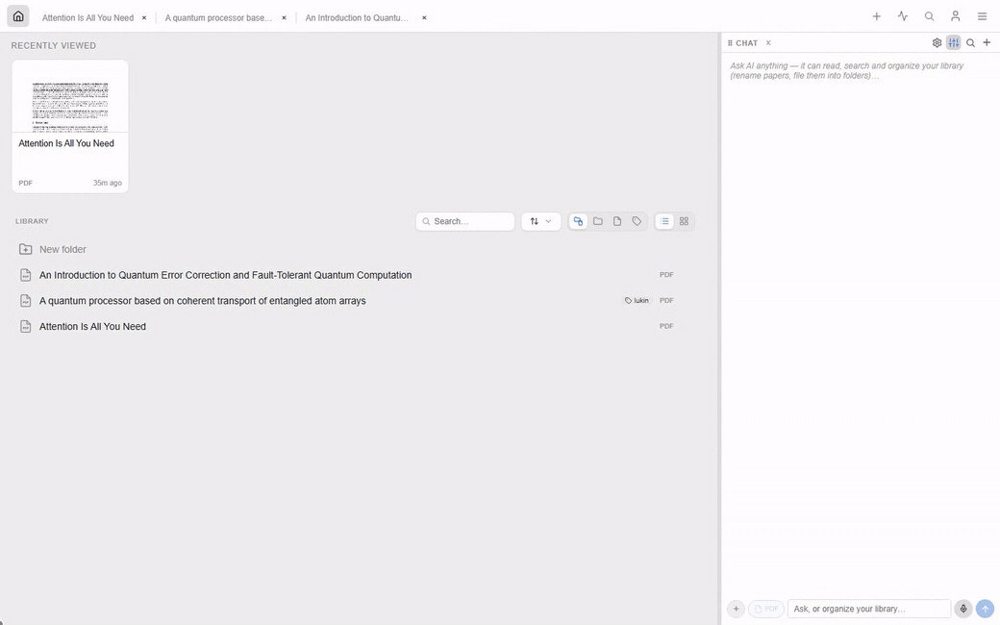
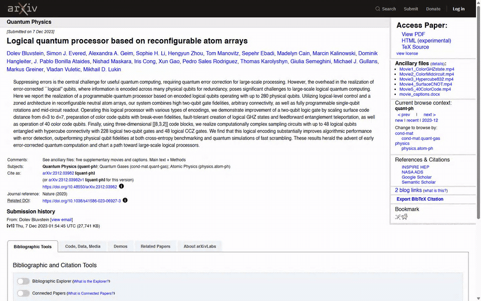
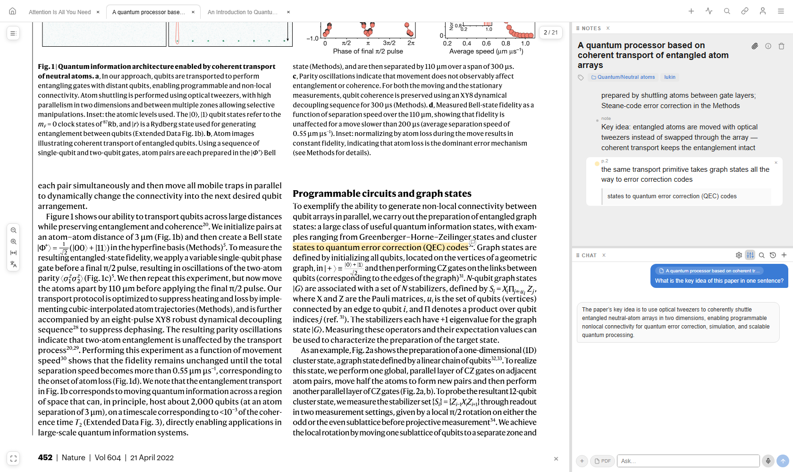

<picture>
  <source media="(prefers-color-scheme: dark)" srcset="./logos/gamma-logo-dark.svg">
  <source media="(prefers-color-scheme: light)" srcset="./logos/gamma-logo-light.svg">
  
</picture>

# Gamma PDF Annotator

**Organize papers and knowledge, in one place.** Self-hosted, multi-user, Logseq-inspired: read and annotate PDFs in your browser, keep the notes as a nested outliner, and link everything together.

## 📄 Annotate & ask


Open a paper by pasting any link (arXiv, DOI, or a publisher page — Gamma finds the PDF) or drag the file in. Then:

- **Highlight** — select text or drag a box around a figure, pick a color, add a comment. Each highlight becomes a block.
- **Outliner notes** — highlights and free notes are the same kind of block: nest them, drag-reorder, `[[link]]` between them, write markdown + math. Click a note to jump the PDF to it (and back).
- **Ask the AI** — chat about the open paper (or pick several at once) with Anthropic or OpenAI models, or just sign in with your ChatGPT subscription — no API key. Paste figures, dictate by voice, or attach the whole PDF so the model sees tables and plots.
- **Dockable panels** — drag any window's grip to the left, right, or bottom; double-click to collapse.

## An agent in your library



Ask the chat to tidy up: it can list, read, and search your papers, rename them, and file them into folders — every step shown as it runs, scoped to the folder you're in.

## 🔗 Link and organize


- **Reference links** — citations in the PDF are clickable: jump to the reference, unwind jumps across documents with a global **← Back**, and fetch a cited arXiv/DOI paper into your library in one click. You can also link a citation to a paper you already have.
- **Labels** — flat, cross-cutting tags for facets like an author or a keyword; a paper can carry several, and each is one click to filter by.
- **Folders** — a topic hierarchy that builds itself from the paths you use: drop a paper into `qc/neutral-atom` and you get a **qc** folder with a **neutral-atom** subfolder — add `qc/superconducting` and the sibling appears, no need to hand-create each level as its own tag. Storage stays flat, so one paper can live in several folders.
- **Search everything** — `Ctrl+F` searches across notes, highlights, and the full text of every PDF at once, with match-case / whole-word / regex toggles. Narrow the scope with chips for **both** labels (exact match, e.g. an author) and folders (prefix match, so `qc` pulls in everything beneath it). Matching is forgiving: "3000" finds "3,000-qubit" across a line break.

<!-- Demo GIF slot ➜ record: dragging a paper into a folder, then a Ctrl+F search lighting up matches. Save as docs/demo-library.gif -->

## Save from your browser



The **Gamma Connector** extension ([extension/](./extension/)) saves the paper you're reading in one click — PDF, metadata, folder, and labels — straight from the arXiv / DOI / publisher tab. Right-click clips a link or a text selection into your notes.

---

## A closer look




- **Metadata & citations** — on open, each paper is resolved (arXiv → DOI → AI) so the title, authors, and venue auto-fill; any field can be hand-edited in the popover. One click copies BibTeX or a slide-ready citation that pastes into PowerPoint with real italics.
- **Tabs follow you** — open tabs sync to your account, so another browser or device picks up right where you left off.
- **Import existing annotations** — highlights already saved in the file by SumatraPDF, Acrobat, or Preview are imported as blocks. Logseq PDF exports import too.
- **Open access fallback** — a paywalled DOI falls back to a legal open-access copy (via Unpaywall) when one exists.
- **Export** — download a zip of all your data (SQLite snapshots + every upload) from the account menu.

---

## Install

### Downloads

Everything a user installs is on the [**Releases**](https://github.com/tim4431/Gamma/releases/latest) page:

- **Desktop app** (Windows installer, macOS dmg) — a self-contained Gamma with local libraries on your disk, no Docker, Python, or Node. It also opens any Gamma server you host (the NAS, a VPS) as another workspace and switches between them from the toolbar. Details: [desktop/](./desktop/). Builds are unsigned: Windows SmartScreen → *More info → Run anyway*; macOS → right-click → *Open*.
- **Gamma Connector** browser extension (`gamma-connector-<version>.zip`) — unzip, then `chrome://extensions` → *Developer mode* → *Load unpacked*.
- **Server** — the Docker image below, built from `main` on every merge.

### Quickstart

```bash
docker run -d --name gamma -p 9001:9001 -v gamma-data:/data ghcr.io/tim4431/gamma:latest
```

Open <http://localhost:9001> and log in as `admin` — a fresh instance seeds the account itself and prints its password once to the log (`docker logs gamma`). No environment variables needed.

### Docker Compose (recommended)

Copy the template (the real file is gitignored, so local tweaks never land in commits) and start:

```bash
cp docker-compose.yml.example docker-compose.yml
docker compose up -d
```

Open <http://localhost:9001> and log in with the seeded `admin` password from `docker logs gamma` (printed once on first start). Everything — accounts, notes, and uploaded PDFs — lives under the container's `/data` volume, so your library survives upgrades. Back it up by copying that volume or using the in-app **Export my data** zip; restore a zip with **Import data** in the same menu. If you bind-mount `/data` to a host folder, set `PUID`/`PGID` to your user's ids (`id -u` / `id -g`) so the files belong to you instead of root.

Users are managed in the app: sign in with an admin account → account menu → *Manage users…* (create/delete accounts, reset passwords, grant or revoke the admin privilege — admin is a flag, not a special name). The CLI equivalent still works:

```bash
docker exec gamma python manage.py create-user alice her-password
docker exec gamma python manage.py set-admin alice on
docker exec gamma python manage.py list-users
```

<details>
<summary><b>Run from source (development)</b></summary>

Requires Python 3.11+ and Node 18+.

**Backend**

```bash
cd backend
python -m venv venv && source venv/bin/activate   # Windows: venv\Scripts\activate
pip install -r requirements.txt
python manage.py create-user admin yourpassword
python manage.py set-admin admin on                 # admin privilege → GUI user management
python manage.py setup                              # seeds the guest account
uvicorn app:app --host 127.0.0.1 --port 9001
```

**Frontend**

```bash
cd frontend
npm install
npm run dev        # :5173, proxies /api → :9001
```

**Tests**

```bash
cd backend
pip install -r requirements-dev.txt
python -m pytest tests -q
```

In-process API tests against a throwaway data dir — auth, the block tree, metadata/BibTeX, PDF-annotation import, full-text search, and export.

**Production without Docker** — build the frontend and let the backend serve it:

```bash
cd frontend && npm run build
cd ../backend
GAMMA_STATIC_DIR=../frontend/dist uvicorn app:app --host 127.0.0.1 --port 9001
```

Put a TLS-terminating reverse proxy (Caddy, nginx) in front of 9001 for a domain. If you use HTTP/3, consider limiting Caddy to `protocols h1 h2` — a Chrome QUIC bug can make large PDFs crawl.

</details>

<details>
<summary><b>Environment variables</b></summary>

| Variable | Required | Default | Description |
|---|---|---|---|
| `GAMMA_DATA_DIR` | No | `backend/` (`/data` in Docker) | Where users.db and per-user data live |
| `GAMMA_STATIC_DIR` | No | unset (`/app/static` in Docker) | Built frontend to serve as SPA; unset = API only |
| `GAMMA_PORT` | No | `9001` | Listen port (Docker entrypoint only) |
| `GAMMA_ADMIN_USER` / `GAMMA_ADMIN_PASSWORD` | No | `admin` / random, printed to the log once | Overrides the account a **fresh** instance seeds itself at startup (only while no real accounts exist; never touched afterwards). Admins manage users from the GUI (account menu → *Manage users…*) |
| `GAMMA_AI_ANTHROPIC_BASE_URL` | No | `https://api.anthropic.com` | Default Anthropic-protocol endpoint, e.g. `https://api.deepseek.com/anthropic` |
| `GAMMA_AI_OPENAI_BASE_URL` | No | `https://api.openai.com` | Default OpenAI-compatible endpoint |

AI is configured in the app, not the environment: each user adds provider entries under account menu → *AI providers & keys…* (pick the API format — Anthropic Messages or OpenAI Chat Completions — then a key, plus optional label, base URL, and model list), or connects a ChatGPT Plus/Pro subscription with *Sign in with ChatGPT* — OAuth, no key at all. Keys are stored server-side per user and never sent back to the browser. The base-URL variables above only change the per-protocol defaults shown in that dialog.

</details>

<details>
<summary><b>Docker image</b></summary>

Published to GitHub Container Registry on every push to `main` (`latest`) and on version tags (`v1.2.3` → `1.2.3`, `1.2`), for `linux/amd64` and `linux/arm64`:

```
ghcr.io/tim4431/gamma
```

Multi-stage build: a Node stage compiles the frontend, the final Python image runs FastAPI serving both the API and the SPA on port 9001. See [Dockerfile](./Dockerfile) and [.github/workflows/docker.yml](./.github/workflows/docker.yml).

</details>

---

## How it works

A single service: a **FastAPI** backend that also serves the built **React** frontend. In dev the two run separately with a Vite proxy. Per-folder notes live in [`backend/`](./backend/README.md) and [`frontend/`](./frontend/README.md) READMEs.

- **Everything is a block.** Highlights and free notes are rows in one `unified_blocks` table (self-referential `parent_id`, fractional-index `position`). Root-level blocks are pages; a page with a PDF is a paper.
- **Per-user isolation.** `users.db` holds accounts and tokens; each user gets their own `pages.db` and `uploads/` folder under `GAMMA_DATA_DIR`.
- **View modes come from the URL** (no router lib): `/` home · `/?page=<id>` a page · `/?block=<id>` jump to a block · `/?share=<token>` public read-only.

<details>
<summary><b>Inspired by Logseq</b></summary>

Gamma borrows the ideas from Logseq that fit PDF annotation: everything is a block, pages are the top-level container, outliner editing (Enter/Tab/Shift+Tab), a depth-snapping drop indicator, nested guide lines, and fractional indexing for order. It's narrower — no graph view, journal, or queries — tuned for "annotate PDFs and keep the notes as a tree."

</details>

## Known limitations

- Autosave is debounced at 500 ms; closing the tab within that window can lose the last keystroke.
- No conflict handling for simultaneous edits across tabs/devices — last write wins.
- Paywalled papers can't be fetched server-side; Gamma substitutes an open-access copy when one exists, otherwise download in your browser and drop the file in.
- `src/App.jsx` is still one large component; decomposition is in progress.

## License

MIT
