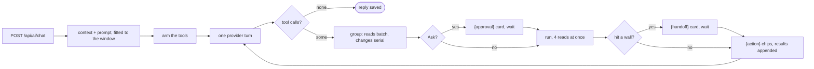

# AI: providers, chat, and the library agent

The AI stack in one place — provider storage and protocols, the `/api/ai/chat`
request/stream shape, and the library agent: what it can reach, how the tool
loop runs, and what the user controls. The tools themselves are catalogued in
[ai_tools.md](ai_tools.md); how long papers reach the model is
[ai_context.md](ai_context.md). Code: `gamma/ai_settings.py`,
`gamma/ai_protocols/` (one adapter per wire), `gamma/ai_client.py`,
`gamma/ai_catalog.py`, `gamma/ai_context.py`, `gamma/ai_tools.py`,
`gamma/chatgpt_oauth.py`, `gamma/routers/ai.py` + the chat-history router.

## Provider and models

There are NO env API keys; providers are GUI entries: each account's own
(Settings → AI › Connections), plus the server's shared ones an admin adds
(below). An account's entries are stored under the reserved account-wide
`ai-settings` pref in `users.db` — a LIST of `{id, name, protocol, api_key, base_url, models}` managed
via `POST/PUT/DELETE /api/ai/providers[/{id}]`. Every change to the list is
one read-modify-write transaction (`ai_settings.update_provider_entries`,
over `db.update_pref`), never a list read earlier and saved back. So a
ChatGPT sign-in, which stores its entry before asking for its first models,
or a token refresh writing back its entry's tokens never drops a key another
tab added meanwhile. An entry offers exactly the
models picked for it (from the provider's live listing in the form): there is
no built-in default model, so an entry with none picked offers nothing and its
Test button says so (migration step 15 wrote the old defaults into entries
that had relied on them). The connect dialog (`ProviderForm` in
`settings/SettingsAi.jsx`) picks the live list's first model when nothing is
picked yet. That is still a pick from the provider's own listing, never a
model name in code, and a new connection is never saved offering nothing.
The same live listing is the dialog's key check ("Key works · 14 models
available", or the provider's refusal). The key field's placeholder and its
"Get a key at …" link come from the adapter or the `SERVICES` preset
(`key_placeholder`, `key_url`, sent with the protocols in
`GET /api/ai/settings`). Both are empty for a sign-in protocol and hidden for
a custom endpoint. A connection made in the dialog is tested right after it
is saved. A saved entry never switches between sign-in and
API key (`PUT` with such a protocol is a 400). The generic prefs endpoints
refuse the key; the only read path is the masked `GET /api/ai/settings` (last-4
hint, never the key), guests can't write. `POST /api/ai/providers/{id}/test`
probes an entry with a tiny live completion for the settings list's Test button
— result in-body, never an HTTP error, and it clears the OAuth refresh backoff
so an expired ChatGPT grant is re-tried immediately. The probe's model:
the entry's optional `test_model` (editable in the form's Models step), else
the `model` sent with the request (the client passes its effective metadata
model — the cheap utility model), else the entry's first model. A failed probe
carries the failure's `kind` (see "Chat endpoint"; `no_model` when the entry
has none picked) and an `auth` flag on 401/403, so the row renders the chat
error card's headline and fix ("OpenAI rejected the API key — Update key"),
the upstream body only on hover. Upstream error
details are summarized before display everywhere (`upstream_detail` in
`ai_client.py`): JSON bodies reduce to their message field, HTML error pages
(a proxy's 502 page) to their `<title>`.

`POST /api/ai/health` ({provider_id, mode}; "" = first entry) is the login
connection check (Settings → AI › Connections → "Check at login",
account pref `gamma-ai-login-check`, default `ping`): mode `"ping"` verifies the
credential for free — OAuth entries hit the usage endpoint, API keys list
`/v1/models`, both 401 on a dead credential (404/405 = gateway without a
listing → ok-but-unverified, no false alarm) — and `"test"` runs the same tiny
completion as the Test button. The answer is always in-body
(`{configured, ok, auth?, kind?, error?}`); a failure renders as a warning
strip in the chat window with the chat error card's headline for its `kind`
("OpenAI rejected the API key"; see "Chat endpoint") and a Fix… button that
opens that entry's form, dismissed or cleared by a passing Test / provider
edit.

`ai_runtime(user)` in `gamma/ai_settings.py` builds the per-request config and
model registry from the account's own entries followed by the server's shared
ones (ids are `<entryId>:<model>`; the wire format comes from the entry's
`protocol`, never from the provider id; the default model is the account's
own first model, else the server's first) — AI endpoints must use it, not
module-level config constants for credentials or model routing. Env vars set
each protocol's administrator-controlled default base URL, including
`GAMMA_AI_CHATGPT_BASE_URL`.

Named services (`SERVICES` in `gamma/ai_protocols/__init__.py`, sent as `services` with the
settings) are form presets: a protocol plus a fixed endpoint and its key
hints, offered under the connect dialog's Other tile above "Custom
endpoint". DeepSeek is
the `openai` protocol at `https://api.deepseek.com`. An entry made from one
stores only protocol + base URL; `provider_label` recognizes the pair and
names the entry after the service when it has no name of its own. The
`openai` wire follows the endpoint (`is_openai_platform` in `ai_protocols/openai.py`):
only OpenAI itself gets `max_completion_tokens`, the Responses API for tool
calls, and the gpt-/o-family filter on its model listing. Compatible servers
get `max_tokens`, Chat Completions tools and their full listing (minus
embedding/audio/image models). Anthropic subscription sign-in is deliberately
absent: Anthropic's terms forbid third-party apps from routing requests
through Free/Pro/Max plan credentials, so Claude is reached with a Console API
key.

The Connections pane also exposes `POST /api/ai/providers/{id}/usage`. For a
ChatGPT OAuth entry it reads normalized subscription rate-limit windows
(`used_percent`, `remaining_percent`, and reset time) without exposing the
bearer token. Opening the pane queries OAuth usage automatically (the Usage
button remains available for a manual refresh). Each window is one compact
summary line above the same progress meter used for storage quota, filled by
the percentage used. Each provider row also opens its model configuration,
where models can be fetched, added, or removed.
API-key protocols return an explicit unavailable result because OpenAI-
compatible and Anthropic-style providers do not share a portable quota API.
An expired ChatGPT sign-in answers in-body (`{available: false, auth: true}`
with a "sign in again" reason) rather than dumping the upstream 401.
The account request deliberately uses the administrator-controlled ChatGPT
protocol URL, not an entry field, and OAuth entries cannot edit their API key
or base URL; this prevents a settings request from redirecting a bearer token.
The ChatGPT account endpoint is provider-specific and may require maintenance
if its upstream contract changes.

### Protocol adapters

Everything that differs between providers lives on one adapter per wire in
`gamma/ai_protocols/` (`base.Protocol`), and nothing outside that package
branches on a protocol id. Routes, the chat loop, `ai_settings` and
`ai_client` ask the entry's adapter (`ai_protocols.of(conf)`):

| Concern | Adapter member |
|---|---|
| what the form offers | `label`, `base_url` (env default, `config.AI_BASE_URLS`), `auth` (`"key"` / `"oauth"` + the `oauth` module that refreshes tokens), `entry`, `key_placeholder` / `key_url` (the key field's hint and "Get a key at" link, for the provider's own endpoint) |
| the chat call | `wire(conf, tools)` (a sibling wire for some calls), `request(...)`, `reply_text`, `read_reply`, `streams_only` |
| the stream | `events` (one loop in the base) over `stream_event` / `stream_end`; a stream without a single event raises `NotAnAIStream` |
| token counts | `usage(raw)` → `{input, output, cache_read, cache_write}` |
| models | `models_request`, `models(data, conf)` → `[{id, context_window, efforts}]` (`listed_window` / `listed_efforts` read whatever the listing carries), `catalog_hints` |
| credential check | `ping_request` (default: the model listing) |
| quota | `has_account_usage`, `account_usage_request`, `account_usage` |
| attachments, dictation | `native_pdf`, `transcription` (a rank), `transcription_request`, `transcript` |
| hosted web search | `hosted_web_search(conf)`: the provider's own search tool as the tools entry to send, or None. A tool spec with a `hosted` entry goes out as that entry, and a stream that used it yields `("web_sources", [{url, title}])`. `search_web`'s AI engine runs it ([ai_tools.md](ai_tools.md)) |

The wires: `anthropic.py` (Messages API), `openai.py` (Chat Completions for
OpenAI and every compatible server), `responses.py` (the Responses API that
OpenAI's platform and the ChatGPT backend both speak; `openai-responses` is
the variant an OpenAI entry switches to for tool calls, never an entry's own
protocol), `chatgpt.py` (the Codex backend: its listing, quota and client
version). `ai_client.py` is the transport (open, read, stream, errors);
`ai_catalog.py` fetches and caches listings and context windows
(`fetch_json` is the one fetch every listing, quota and ping goes through).
The sign-in flow itself (`chatgpt_oauth.py`, `/api/ai/oauth/chatgpt/*`) is
provider-specific by nature.

A new service on an existing wire (a gateway, a hosted model) is a
`SERVICES` preset or just a custom base URL. A new wire is one module
subclassing `Protocol` (or `ResponsesWire`) that overrides what differs from
the OpenAI-shaped defaults, plus one line in `WIRES` and its default URL in
`config.AI_BASE_URLS`; `tests/test_ai_wire.py` pins each wire's request and
stream shapes.

### Shared provider entries

An admin can add provider entries for the whole server (Settings → Server →
Shared AI provider, `/api/admin/ai-providers*`), so the members of a lab do
not each need a key. A shared entry has an account entry's shape (`id, name,
protocol, api_key, base_url, models, test_model, created_at`, plus `oauth`
for a sign-in). It holds an API key, or a ChatGPT subscription the admin
signs in to from the same form: `POST /api/admin/ai-providers/chatgpt/start`,
`status` and `complete`, the account flow's `begin_chatgpt_signin` /
`redeem_chatgpt_signin` with the state bound to `("server", <admin>)`, so
neither flow's state redeems on the other. `provider_id` on `complete`
reconnects an entry. The same helpers validate both lists (`new_key_entry`,
`update_entry`, `apply_provider_fields`, `mask_entry` in `ai_settings.py`).

- **Stored** in the users.db `settings` KV under `ai_providers`:
  `{providers: [...], guests: bool, allowance: {accounts, guests}}`, at most
  `MAX_PROVIDERS` (20) entries. Each `api_key` and each sign-in's `oauth`
  tokens are Fernet-encrypted with the data directory's key, like the cloud
  client secret (`publisher_sessions.cipher`). One that no longer decrypts
  reads as none and logs a warning.
- **Refreshed** under the entry's own lock (`_refreshed_server_oauth`):
  every account's requests refresh the same tokens, and OpenAI rotates the
  refresh token. Only the tokens are written back. The refresh backoff is
  reset only by an admin's Test, usage query or login check, so a dead
  shared grant is not retried on every account's login.
- **Masked**: the last-4 key hint and the signed-in e-mail (`account`) are
  for admins only.

Ids are namespaced, `server:<id>`, so a shared entry's models
(`server:<id>:<model>`) never collide with an account's; the registry marks
them `shared: true`. `ai_runtime` (via `shared_access`) offers them to
every account after its own entries. Guest accounts get them only while
the admin switch `guests` is on (default off); a name that is not an account
(a link visitor) never does. `GET /api/ai/settings` lists them after the
account's own as read-only rows (`shared: true`); `/api/ai/providers/{id}`
never edits or deletes them (404). An admin may name a shared id on the Test
probe, the model catalog and a sign-in's subscription usage
(`/api/ai/providers/{id}/usage`); that is how the Server section's form lists
models and tests a saved entry. The login check (`/api/ai/health`) accepts
any entry the account can use. Token usage stays per account: a member's
calls through a shared entry are recorded on that member (provider id
`server:<id>`), and there is no server-wide meter.

**The allowance.** The admin may cap the tokens each account spends through
the shared entries in a rolling 24 hours. Its limits, storage and Reset rule
are in [guests.md](guests.md) "The shared AI allowance". The one choke point
is `ai_client.open_ai` (`call_ai` goes through it): `check_allowance`
re-reads `ai_usage.shared_used` on every call and raises
`AllowanceExhausted`, an `HTTPException` 429 whose detail points at
Settings → AI. How each caller surfaces it:

- Chat, both modes: the stream opens eagerly, so a refused first call is a
  real 429; a later agent round ends the stream with the detail as its
  `error` line.
- Translation: the stream variant checks before it starts.
- Metadata extraction and `/metadata/cite` let the 429 through.
- The Test probe and the login test report it in-body.
- Dictation reports no tokens, so it is not metered, only refused once the
  allowance is used up.
- Model listings and the context-window lookup spend nothing and are never
  refused.

**Calls open at once.** The same choke point caps the provider calls one
account may have open: `ai_client.MAX_OPEN_CALLS` (6). An open call holds a
server worker thread for as long as the provider takes, and those threads
serve every other request too (a PDF page read included). So the seventh is
refused with `TooManyCalls`, a 429 whose detail points at the translation's
parallel requests. `open_ai` takes a slot before it connects and returns the
response wrapped (`_OpenCall`), which frees the slot when it is closed. Every
caller closes its response when the reply ends or fails, a stream's
generator also when its client goes away; a response dropped unread frees
its slot when it is collected, and a failed connect at once. Both refusals
derive from `CallRefused`, so every caller above treats them alike
(`failure_kind` calls this one `rate`). The streamed translation checks both
before its stream starts (`check_call_slot`). Dictation and the model
listings bypass `open_ai` and are not counted. The pool itself is raised
from AnyIO's 40 to `app.THREAD_TOKENS` (100) at startup.

### The chatgpt protocol (OAuth)

A third protocol, `chatgpt`, holds OAuth tokens instead of a key (Codex CLI's
PKCE flow in `gamma/chatgpt_oauth.py`; entries created only via
`POST /api/ai/oauth/chatgpt/start`, `status` and `complete`; access tokens
refresh lazily in `ai_runtime`). Its wire is the Responses API on
`chatgpt.com/backend-api/codex` (stream-only SSE; non-stream callers join
deltas), and PDF attachments go as native `input_file` parts with an automatic
retry as extracted text if the backend rejects them. That retry applies to
any provider that answers a native-PDF request with a 4xx other than
401/403/429 (compatible servers may refuse `file` parts too). Anthropic has
no `minimal` or `none` effort; its adapter sends `low` for `minimal` and
leaves the parameter out for `none`.

Its model list (`POST /api/ai/model-catalog`) is Codex CLI's own listing call,
`GET {base}/models?client_version=…`, made with the entry's token. The backend
hides models newer than the client version it is told, so Gamma claims the
newest Codex CLI release: npm's `latest` for `@openai/codex`, cached for 6 h
(`codex_client_version` in `ai_protocols/chatgpt.py`; on a failed lookup the last good version, else a
floor constant, with a retry after 10 min). No model names are hardcoded. A
failed listing is a 502 the picker shows, and a fresh connect whose listing
fails starts with no models. The sign-in `state` belongs to the account that
started it. Token refreshes are serialized per account and re-read the
entries first (`_refreshed_oauth` in `ai_settings.py`): OpenAI rotates refresh
tokens, so of two parallel refreshes the second would fail and save stale
tokens over the fresh ones.

**How a sign-in reaches the server.** Codex CLI's client id has one
registered redirect, `http://localhost:1455/auth/callback`, which only works
where something listens on the browser's own machine. `chatgpt_oauth.begin`
keeps each sign-in in memory (15 minutes, bound to its owner) until the first
of three endings:

- **Caught.** When the page runs at a loopback address and the request came
  from loopback (the desktop app's own server, a localhost install; a
  reverse proxy on the same host passes only the second test), the server
  listens on `127.0.0.1:1455` for the redirect and exchanges its code. The
  listener takes the port only while such a sign-in waits and never with
  `SO_REUSEADDR` on Windows, so Codex CLI's own login or another Gamma
  server holding the port makes it fall back to the other two.
- **Device code.** Otherwise `start` also asks OpenAI for a one-time code
  (Codex CLI's `--device-auth`: `POST /api/accounts/deviceauth/usercode`,
  then `/token` until the user enters it at `auth.openai.com/codex/device`,
  the answer's code exchanged with its own verifier and the redirect
  `https://auth.openai.com/deviceauth/callback`). There is no poller thread:
  each `status` call polls when OpenAI's interval is up, so polling stops
  when the form stops asking. The account has to turn device code sign-in on
  in ChatGPT's security settings (a workspace's admin, for Edu and
  Enterprise), which is why it is offered next to the paste, not instead of it.
- **Pasted.** The redirect page fails to load and the user pastes its
  address; a paste that doesn't parse leaves the sign-in waiting.

The form (`useProviderEditor` in `SettingsAi.jsx`) asks `status` every 2.5 s
while the server may catch the sign-in, and calls `complete` with an empty
`callback` once it is `ready`. A paste of a callback address connects without
the Connect button, and in Chromium the address is also picked up from the
clipboard when the tab regains focus (the browser asks once). Both are
unofficial OpenAI endpoints, like the rest of this flow, so they may need
maintenance.

## Chat endpoint

`/api/ai/chat` speaks both the Anthropic Messages API and the OpenAI Chat
Completions API. Requests carry a model-registry id, optional `effort`
(→ Anthropic `output_config.effort` / OpenAI `reasoning_effort`; omitted unless
set — some models reject it; see "Reasoning effort" below), optional `system` override, pasted `images`
(data URLs → native image content parts), and the context PAGES: `pages`
(several — a report across pages) or, when empty, the one page of `page_id`
(the open page). A page's PDF attachment is derived server-side
(`blocks_store.page_attachment`) — `doc_id` is still accepted as a
compatibility input: it resolves to the page carrying that PDF
(`blocks_store.page_for_doc`) and does nothing when no page does; send
`page_id`, nothing new may depend on `doc_id`. `stream: true` (the chat UI's
mode) returns NDJSON lines of
`{"delta"}`/`{"error"}` parsed from the provider's SSE; upstream failures
before the first byte still return normal HTTP errors. Every AI NDJSON
stream (chat, the tool loop, translation) runs through `keepalive_lines`
(`routers/ai.py`), which pumps the source generator from a worker thread.
A `{"ping": 1}` line goes out after 15 s of silence, so a reverse proxy's
idle timeout (nginx and Synology default to 60 s, Cloudflare to 100 s) does
not cut the response while the model thinks over a long context.
Clients skip `ping`. A consumer that leaves before the source
ends (Stop, or the connection dropped anyway) stops the source at its next
yield and logs a warning with the elapsed time.

A failure says what kind it is. `ai_client.failure_kind` classifies it in
one place, from the upstream status and, for an error event inside a
stream, the provider's wording:

- `not_configured`: no usable connection (the 503).
- `allowance`: the shared allowance is used up.
- `auth`: 401/403. `rate`: 429 or a quota. `overloaded`: 5xx or 529.
- `unreachable`: no connection, a timeout, a cut-off stream.
- `bad_endpoint`: a 404 page, a reply that isn't JSON, or a stream without
  a single server-sent event (`ai_protocols.base.NotAnAIStream`).
- `too_long`: the prompt exceeds the context. Anything else is `other`.

`_failure_info` in `routers/ai.py` puts that `kind` beside the plain-string
`detail` of the HTTP error (a `JSONResponse`) and on the stream's closing
`{"error"}` line. It adds the connection (`provider_id`, `provider_name`,
`provider_auth`); an upstream status needs no field of its own, since the
detail already opens with it ("upstream 529: …"). The login check
(`/api/ai/health`) and the Test probe carry the same `kind`, and the probe
one more: `no_model`, an entry with no model picked.

The client saves the classification on the reply (`errorKind`,
`errorDetail`, `errorProvider`, `errorProviderId`, `errorAuth`) and
renders a card instead of the raw text. `chat/chatErrors.js`
holds the copy per kind: a headline ("OpenAI rejected the API key", "Lost
the connection to Gamma" for the browser's own `TypeError`), one sentence,
and the fix. The login check's warning strip and the Test result on a
Settings connection row show the same headlines.
Update key / Sign in again / Edit connection open Settings → Connections on
that entry's form (`openAiKeysEditor({entry})` in App). Connect AI and Add
your own key open the pane; New chat starts over. On the latest reply,
Retry re-sends the question through the edit-and-resend path, and Switch
model retries with the model picked. The provider's own text is folded
under "Details from the provider".

A failure with no reply text is an AI message carrying `error: true`. It is
saved with the chat so it survives a reload, but left out of the `history`
the client sends on later turns (`build_messages` skips such items too,
should an older client send them). A reply that broke off keeps its text
and gets the compact card under it. Replies saved before the classification
keep their plain red bubble.

Context is *pages from the user's knowledge base* (`ai_context.gather_inputs`
→ `page_report_section`): each page contributes its title, a properties line
(folders, labels, cached metadata, web source, attachment) and its notes
tree; a page that carries a PDF adds the document's extracted text (a head
excerpt labelled with the pages it reaches when the document doesn't fit —
see [ai_context.md](ai_context.md)), or the PDF itself as a native
document/file content part when the request sets `attach_pdf`, and shows its
notes only with `include_notes`. A page without an attachment IS its notes,
so they always go — `include_notes` only means "also add my notes/highlights
for PDF pages". An area highlight among them (a Ctrl+drag rectangle, no
text) is named with its page and its region goes along as a picture, up
to `MAX_AREA_CROPS` per page ([ai_tools.md](ai_tools.md) read_page — the
same for the tools). The built-in chat system prompt frames the model as working
inside that knowledge base and grounds claims about the pages in text
actually read (look details up or say they're absent, never fill gaps from
memory; cite a PDF by page number, say when something comes from the user's
notes). With a document in context, `_CITATION_PROMPT` is appended, custom
prompt or not. It asks for `[p. N](/?page=<id>&pdf_page=N&quote=…)` links
built from the `[PDF page N]` labels and the `Gamma page ID` each context
section carries ([pdf_citations.md](pdf_citations.md)).

`gather_inputs` returns the context in two parts, and `build_messages`
places them apart on purpose. The **document part** (the pages' sections:
excerpt, notes, the document map) is glued to the *oldest* user turn, so it
reads the same on every turn of a conversation while its pages and
settings stand; the **message part** — the text around the passages this
message selected, the cursor block, attached chips
(`notes_focus_section`) — goes in front of the question itself under a
"Context for this message" line. The stable head is what the providers'
prompt caches key on (see "Prompt caching" below); the moving part stays
small.

Whatever went to the model is reported back: the stream's first line is
`{"context": [...]}` (non-stream: a `context` field) with one entry per
page — `title`, `page_id`, `doc_id` (`""` for a page without a PDF),
`native` (the file itself was sent), `native_requested`, `partial`,
`chars`, `pages`, `pages_shown`, `notes` (the page's notes are in the
context) (uploaded `files` are reported the same way, and get the
single-page budget when they fall back to text). The same report rides in
the tool scope as `coverage`: `agent_system` names the pages the context
holds and where to read on (`coverage_lines`), and `read_page` never
repeats them ([ai_tools.md](ai_tools.md)). The chat saves it on the reply
and shows a pill (`.chatPill`, the agent-steps pill's look) only when it
matters: "Model saw pages 1–9 of 22" for a truncated paper — with what the
reply's tools read folded in ("· read 10–12 with tools", from the read
actions' `pdf_pages`) and, unfolded, the pages nobody saw, a rough token
figure, and advice that depends on whether the reply had tools
(`chat/coverage.js`); "PDF file not accepted — sent as text" when the file
was requested but the provider took text instead. Two more pills per
reply: "Earlier messages left out: N" (the stream's `{"trimmed": {turns}}`
line, see "Fitting the window") and "Reply cut off at the output limit"
(`{"truncated": true}`: the provider's stop reason was `max_tokens`,
`length` or the Responses API's `incomplete` — `Protocol.events` ends every
stream with `("stop", reason)`, `ai_protocols.base.truncated_stop` reads
it; the agent loop stops there rather than run a half-written tool call).
`/api/ai/models` marks each model `native_pdf` (false for
ChatGPT sign-in entries: their wire is the Codex backend, which refuses
`input_file` parts). The composer's Full PDF switch, shown only while a PDF
is in context, doesn't default on for such a model. Switching it on by hand
shows a warning pill, and pending uploaded PDFs get the same warning on
their chips. `/api/ai/models` also says `transcribe`: whether some
connection takes dictation (`Protocol.transcription` > 0, an OpenAI-protocol
key, models picked or not). These are the entries `/api/ai/transcribe` picks
from, and the composer's mic shows only then.

PDF extraction (`gamma/pdf_text.py`) is serialized behind a lock — pdfium is
not thread-safe and overlapping extractions fail both — and reads up to
`MAX_PAGES` (5000, a runaway guard that logs when it bites; pages past it are
invisible to search AND read_page, so keep it far above real documents).

### Exporting the context

The chat header's download button saves what the model would be sent right
now as a Markdown file. ChatDock builds the body with the same
`chatRequest(text, history)` a send uses, with the composer's draft as the
prompt. `POST /api/ai/chat/context` runs it through `_chat_prompt`, the one
step `/ai/chat` also uses for its turns and system prompt, and
`ai_context.context_markdown` writes the result: the pages in context (the
coverage report), the system prompt, the tool specs, then every turn as
sent, each in a fence longer than any backtick run inside it. The document
context sits on the oldest question and the draft is the last turn. Two
things differ from a live send. PDFs always go as extracted text (the file
is meant to be read or pasted somewhere else, so `attach_pdf` is ignored),
and pictures are counted but not embedded. Nothing is trimmed to fit a
window, and no provider is called.

### Prompt caching

Every request re-sends the whole conversation (no wire keeps state:
`store` stays off on the Responses API, and there is no
`previous_response_id` — the conversation is Gamma's to keep). What makes
that cheap is the providers' prefix caches, which every adapter now asks
for. The chat sends `chat_key` (the bucket: a page id, `home`,
`home:<folder>`); `_cache_key` in `routers/ai.py` hashes it with the
account and workspace into one opaque id per conversation that
`ai_client.open_ai` passes to `Protocol.request(cache_key=)`:

- Anthropic (`anthropic.py` `_with_breakpoints`): `cache_control:
  {type: "ephemeral"}` on the last tool spec, the system prompt (sent as a
  content block then) and the last two user turns — the API's four
  breakpoints; the one a turn back keeps the lookup within reach when a
  reply's tool rounds add many blocks after it. Only on `api.anthropic.com`
  (`is_anthropic_platform`): a service speaking the API behind another
  host may reject the field.
- OpenAI: `prompt_cache_key` on Chat Completions and on `/v1/responses`,
  again only on the platform itself (`is_openai_platform`), never on a
  compatible server.
- The Codex backend: the same `prompt_cache_key` in the body and the
  `session_id` header, one per conversation like Codex CLI's (a fresh
  uuid per request, as before, missed every time).

The usage line's `cache_read` / `cache_write` counts (and "% cached" under
a reply) show whether it works. The document context glued to the oldest
user turn is the cached head; it changes only when the pages, the notes,
the map or the context settings change.

### Fitting the window

Nothing is trimmed by turn count or summarized. Before a call the router
estimates the prompt (`ai_context.prompt_tokens`: four ASCII characters or
one other character — CJK, symbols — per token, 1,600 per picture; native
PDF files are not counted) against the model's window
(`ai_catalog.context_window`, the same lookup as the header's ring) less
`_WINDOW_RESERVE` for the reply, and leaves the oldest history items out
(`build_messages(drop_turns=)`: two, then doubling; the kept history opens
on a question, the document context moves to the oldest kept one) until it
fits. A provider that still answers `too_long` (no source knew the window,
or the estimate fell short) is retried the same way. The stream says
`{"trimmed": {"turns": N}}` after the model line and the chat shows the
pill. Within one reply, the rounds' tool results share
`ai_context.LIVE_RESULT_BUDGET` (60,000 chars, a picture counting
`_IMAGE_CHARS`): a valve, not a per-round trim — rewriting an earlier turn
costs the cache the rest of the prefix, so nothing is touched until the
results outgrow the budget, then `elide_live_results` turns the oldest
rounds' results into the replay's stub, the last `LIVE_KEEP_ROUNDS`
rounds always whole; a `too_long` mid-reply keeps only the last round's
results and retries once. The native-PDF fallback (a 4xx on a request
with file parts is retried as text) no longer remembers a provider as
refusing files when the failure was the size.

### Reasoning effort

The chat keeps ONE preferred effort (the account pref `chatEffort`, set from
the composer's model chip or Settings → Assistant → Chat) and sends each
model the level it takes. `GET /api/ai/model-info` names a model's levels,
lowest first, looked up live like its context window
(`ai_catalog.reasoning_efforts`): the entry's own listing first
(Anthropic's `capabilities.effort.<level>.supported`, the Codex backend's
`supported_reasoning_levels`), else models.dev's `reasoning_options`
(`{type: "effort", values}`; a model that doesn't reason or only takes a
token budget has none). `[]` means the model has no effort control: the
chip's menu drops its effort section and nothing is sent. A model no source
knows gets `/api/ai/models`' generic `efforts` (low / medium / high). The
preference itself never changes with the model: `effortFor` in
`chat/effort.js` sends it as it is when the model takes it, else the
nearest level the model does (a tie goes to the lower), so `xhigh` becomes
`high` on a model that stops there and comes back on the next model that
has it. The chip shows that effective level beside the model's name. The
server accepts `EFFORT_ORDER` (none … max) and drops anything else.

Every reply names what answered it: the stream's `{"model": {id, name,
effort}}` line (after `{context}`) is saved on the reply as `model` and
`effort`, and the reply's foot shows "gpt-5.5 · high" before the token line.
`GAMMA_MODEL_CATALOG=off` keeps the server from asking models.dev at all (an
offline server; the browser suite sets it); model facts then come from the
providers' listings alone.

### Selected PDF passages

A PDF selection reaches the chat with its position. App keeps
`pdfSelections` as `{text, page, box}` (`pdf/pdfSelectionSpot.js`:
`rangeSpot` for a live selection, which gives the page its start sits on and
the union of its rects there, and `highlightSpot` for a clicked highlight's
stored position). `box` is `[x0, y0, x1, y1]` as fractions of the page,
top-left origin. The request sends them as `selections`, at most 6 × 4000
chars. The older `selection` string ("---"-joined text) is still read when
`selections` is empty (`ai_context.request_selections`).

The single-paper text context then centres on the passages instead of the
start of the paper (`selection_context`):

- **Placing.** Each passage is matched on normalized text
  (`_locate_passage`, page-seam aware), on the viewer's page first and then
  anywhere. A phrase the paper repeats therefore lands where it was
  selected. A passage whose text isn't found (a formula's glyph soup, or
  anything under 12 chars) still gets the viewer's page, placed by its box's
  top.
- **Window.** The budget goes to a small head slice (dropped when a window
  already reaches the top) plus one window per passage. The window opens up to
  2500 chars *before* the passage, where its set-up and definitions are,
  crossing into the previous page when needed. Each page part carries its
  `[PDF page N]` label. Passages inside an earlier window share it.
- **Section.** Each passage is labelled with the section it falls under.
  The PDF's own outline is read first (`pdf_text.outline`): the path of
  entries before the spot, with figure bookmarks and a lone title entry
  left out. An entry on the spot's own page counts only when its title
  stands as a heading line before it (`_title_offset`), so the word
  "Attention" in the prose is not the "3.2 Attention" heading. Without an
  outline, the nearest heading-shaped line before the spot is used: the
  numbered, Roman-numeral, lettered and named-section shapes (`_heading_line`,
  which rejects reference entries, tables of contents and body lines like
  "852 nm").
- **Picture.** When a passage's text wasn't found, or reads as a formula or
  table (`text_unreliable`: math symbols, private-use glyphs, many
  one-character tokens), `selection_crops` renders its box from the PDF
  (`pdf_text.render_page(..., box=)`), grown to a readable strip and padded.
  At most 3 pictures per message; they ride with the user's own images.

The question labels each passage "Selected passage (PDF page 7; section
"Methods › Noise model"; a picture … is attached)" (`final_prompt`, from the
located entries `gather_inputs` puts in the open paper's coverage as
`selection: {passages: [{page, section, found, crop, box}]}`, `box` only
with a picture: the grown crop box, rounded). The reply's chip reads "Model
saw text around p. 7 · Methods › Noise model", plus "Picture of the selection
sent" when one went; opening that pill shows the picture, drawn again from the
saved page and box by `GET /api/ai/selection-crop/{doc_id}` through the same
`render_selection_crop`. Replies saved before the box was kept show the pill
without a picture. Nothing placed at all falls back to the
plain head excerpt. With a native PDF attachment there is no window and no
picture, and the passages carry the viewer's page only.

### Mentioning library papers

`chat/PaperMentionInput.jsx` owns the picker. `chat/paperMentions.js` owns mention text edits
and `MAX_CHAT_REFERENCES`, shared with `chat/ChatDock.jsx`. The six-reference UI limit
mirrors the API's seven-page limit (`pages`, de-duplicated server-side),
leaving one slot for the current page.

Type `@` in the chat composer to search library titles with the same ranking,
typo tolerance, and separator matching as library search (`library/librarySearch.js`).
Arrow keys choose a result; Enter or Tab attaches it, Escape dismisses the
query, and clicking or tapping a result also works. Results include author,
year, venue, and folder details. A completed mention inserts the title and
adds a removable context chip; the chip controls which page IDs are sent.
The `+` menu offers the same library search.

References persist for follow-up questions and are saved as `contextPages`
on each user message. Loading a conversation restores its last references;
editing an earlier message reuses that message's references. Each contributes
its title, metadata, summary, and PDF excerpt (or native PDF), with optional
notes/highlights. The multi-paper text budget is shared by valid pages; a
selection still centers the open paper's excerpt. Tool-enabled chats also
receive document maps labelled with page IDs.

Explicit references expand `read_page`, `read_block`, and `search_library`
access within the current workspace, even outside the original page/folder.
They never expand the editing scope. PDF search hits identify their Gamma
page IDs so the assistant can read further or cite the matching paper,
including when titles are identical. References are resolved server-side;
missing pages and non-page blocks are ignored.

### Pointing the chat at notes

Three optional request fields say what the message is about inside the
notes. The server resolves all three against the request's context pages.

- `focus_block_id` — the block row the cursor is on (`focusedId` in
  `app/App.jsx` → `focusedNote`). The chat shows it as a "Block at your
  cursor" chip, like a PDF selection, and sends it with every message. The
  chip's × leaves it out until the cursor moves to another block. Opening a
  page focuses no row (it lands where the reader left off, else at the top,
  and only flashes that row), so the chip first appears after a real click
  or caret move. Explicit jumps (a `?block=` link, a highlight, a backlink,
  a search hit) do focus their row. Its text and sub-blocks enter the
  context as an id-labelled outline ("The user's cursor is on this note
  block …"), and the agent prompt says "this block" / "here" mean that id.
  So *"expand this"* edits the right block without a `read_block` first.
- `context_blocks` — ids of blocks attached as chips: Ctrl+click a block
  row, or the ⋮⋮ handle menu's **Add to chat** (`onAddToChat` → `chatNotes`
  in App). Each is served as `[id] text` with its subtree indented
  (`ai_context.notes_focus_section`, the same form `read_block` uses), and
  the agent prompt lists the ids, so *"rewrite these"* means them. Capped at
  12 chips / 12k chars (`MAX_CONTEXT_BLOCKS`, `MAX_BLOCK_SECTION_CHARS`).
  Ids outside the context pages, and page ids, are dropped silently.
  Handwriting blocks and pages of paper are labelled the way `read_block`
  labels them, in the cursor block too. An attached one also sends its
  picture with the message, the same picture `view_ink` gives (up to
  `MAX_INK_PICTURES`, 2, riding with the selection crops). The cursor block
  never sends a picture, since it goes with every message. A handwriting
  block's **Transcribe with AI** (⋮⋮ menu, `onTranscribe` → App's
  `transcribeInk`) attaches the block and sends "Transcribe this
  handwriting into its caption." through ChatDock's `askSignal`. The send
  waits until the conversation has loaded, and while a reply streams the
  request goes into the composer instead.
- `note_selections` — selected note text as exact ranges of block sources,
  `[{block_id, from, to, text}]`; `text` is the source slice the client saw.
  Two sources feed it:
  - The open editor's selection. A plain drag on a rendered note opens the
    editor and keeps selecting in the raw source. App's `noteSel` (settled
    120 ms after the last change) turns the cursor chip into a "Selection
    in this note" chip. It survives the editor closing when the chat input
    is clicked, and is dropped once sent.
  - A Ctrl+drag across rendered text. `sourceRangeOfSelection`
    (`editor/clickToSource.js`) maps both ends back to source offsets and
    widens an end inside a formula to the whole formula. A selection it
    can't place attaches its block instead.

  `ai_context.request_note_selections` validates them and labels them S1,
  S2… (6 max). The prompt quotes each with its block id, and each
  selection's block rides along whole in the notes-focus section. Both the
  prompt and the agent prompt say that a question is answered in the chat,
  while an instruction that transforms the selection (rewrite, fix,
  translate, …) is an in-place `edit_block` mode `"selection"`. Without that
  rule a small model answered "translate this" with the translation in its
  reply.

Chips render in the composer's chip strip next to PDF passages
(`SelChip` in `chat/ChatDock.jsx`). Each is two lines. The first is a label
saying what it is in words, with its icon: "Block at your cursor · added
automatically, × to leave out", "Selection in this note", "PDF passage ·
p. 7", "Attached block", "Selected note text". The second previews the text
with the markdown dropped and inline math typeset (`chat/chipText.js`,
KaTeX; the words between formulas go through search's `plainSnippet`, the
same rule as the search rows and the `[[` picker). A dashed border marks what rode along by itself (the cursor block
and the editor's selection in it); what the user attached keeps a solid
one. They clear on send and on a page switch, since the ids belong to the
page. Ctrl+click on a highlight card sends the quote as a PDF passage, not
a block chip.

Reasoning models burn invisible tokens — keep `max_tokens` generous (empty
responses raise with the finish reason). `/api/ai/models` feeds the chat
panel's model chip and the prompt editor (four editable prompts: chat system,
metadata extraction, PPT citation — defaults in `ai.py` — and the library-agent
base prompt, default in `ai_tools.py`).

## The library agent

The chat is more than a chatbot: it can act on the library through tools the
server executes on its behalf ([ai_tools.md](ai_tools.md) describes each one).
What it can reach depends on where the chat is opened — every chat declares an
`agent_scope`:

- `"folder"` — the home/folder chat (`folder` = current path, `""` = root):
  tools reach the pages in that folder.
- `"page"` — the page chat (`page_id` = the focused page, with or without a
  PDF): tools reach only that page — the reading tools plus the note-block
  editors; the page-level organizers (list/rename/move) don't exist there.

The request also carries `permissions`, the tool map of the chat's KIND with
one state per permission (see below), and `granted`, the permissions this
conversation allowed on an approval card. Optional `agent_system` is a custom base
prompt (the Prompts pane's "Library agent" entry, default
`ai_tools.AGENT_PROMPT` via `/api/ai/models`). The scope and permission lines
are always appended mechanically to the base prompt, so a custom prompt can
change the agent's style but not widen its reach. Everything off (or no/invalid
scope) = plain chat. Among those mechanical lines: with a reading tool armed,
the model is asked to link the pages it refers to as `[title](/?page=<id>)`,
which the chat opens in place (details in [ai_tools.md](ai_tools.md)).

The changing tools (rename, move, the note editors) are armed only when
`auth.can_write` lets the request write: an editor or owner, and through an
integration token only a write-scope one. A workspace viewer or a read-scope
token gets the reading tools only (the prompt then says changes are not
available here), and `run_agent_tool` refuses a changing tool called anyway.

### Permissions and knobs (Settings → Chat)

The **Assistant tools** switch (`gamma-ai-agent-enabled`, default on)
governs tool use in every chat. The chat header's Tools button and settings
popover edit the same account preference; New chat does not reset it.
Under the permission table, **Fetch blocked papers in the background**
(`gamma-ai-fetch-background`, default off) lets a blocked fetch's card hand
the page to Gamma Connector without a click, and **Read long papers with a
helper** (`gamma-ai-delegate-reads`, default on) offers `read_paper`, which
gives one document to a second agent and keeps only its cited answer
([ai_tools.md](ai_tools.md#read_paper)). Both are account-wide, not
per-chat-kind: they change how a tool works rather than what a chat may
reach.

Which tools a chat may use is configured per chat KIND — there are three
(`CHAT_KINDS` in `app/prefDefs.js`, `CHAT_KIND_ROWS` in `settings/AssistantTools.jsx`):

- **Folder chat** — the home/folder view (`agent_scope: "folder"`).
- **PDF chat** — a page with a PDF attached (`agent_scope: "page"`).
- **Notes chat** — a page without one (`agent_scope: "page"`).

Each permission has one of three states (`gamma/ai_permissions.py` on the
server, `chat/chatSettings.js` in the client):

- **Allow**: its tools run whenever the model calls them.
- **Ask**: its tools are offered, and each call waits for the user's answer
  on an approval card in the reply ([Asking before a call](#asking-before-a-call-approvals)).
- **Off**: its tools are not offered, and a call is refused.

Reading is allowed by default and changes ask: Save papers, Rename pages,
Move pages, Restore deleted pages and Edit note blocks start at Ask. The server gives a permission the request
leaves out the same default, so a changing tool added later asks until the
user allows it. **Use journal sign-ins** is part of fetching, not a call of
its own, so it is only Allow or Off.

Settings → Chat → Tools compares permissions in a table: named, explained
rows grouped into **Read your library**, **Web research**, and **Make changes**,
with a column for each chat kind. Each cell is a state menu whose icon shows
the state: a green check, the accent's question mark, a muted ban.
Unavailable tools show a dash. On narrow panes, each tool's labeled menus
sit below its description. Each column offers four presets:

- **Read library**: library reading only.
- **Read & search**: reading, web search and fetching.
- **Ask before changes**, the default: also the changing tools, each asking first.
- **Allow all**: everything, without asking.

Individual changes show **Custom**. The stored map is account-synced. Its
localStorage JSON is `gamma-ai-agent-perms` = `{folder, pdf, notes}` →
`{list, read, block_read, view, search, web_search, web_read,
publisher_cookies, save, rename, move, restore, block_edit}` → `"allow"` /
`"ask"` / `"off"`, and a pre-kind flat map is applied to every kind on read.
A stored boolean is the older on / off value (`normalizePerm`): `false` is
Off, and `true` is the permission's default. So a change that was on asks,
and reading stays allowed. The server reads a sent boolean as on / off,
`true` meaning Allow, which is what an older tab sends.
The chat header's ⚙ popover carries the same picker for the kind of chat it
is opened in: `AgentToolPicker` in `settings/AssistantTools.jsx`, grouped
rows with the same state menus and presets. It is bound to the same map, so
a change in either place is the same change.
`ChatDock` derives its kind from its props (`organizeFolder` set → folder;
else `pageAttach` → pdf; else notes) and sends that kind's map as the
request's `permissions`.

One permission per capability: List pages (`list_pages`, the folder tree
`list_folders` and Recently deleted `list_deleted`), Read pages (`read_page`, the page and folder chats
`read_chats`, and the citation records `cite`), Read note blocks, View pages
and handwriting (`view` → `view_pdf_page`, a rendered page picture for a
scan or a figure, and `view_ink`, the user's handwriting), Search library (`search_library` — notes and PDF text; the stored key is
still `search`), Search papers online (`web_search` → `search_papers`,
`related_papers` and, when the account has a web engine for this chat,
`search_web`), Fetch documents (`web_read` → `fetch_paper`; the web tools are
read-only and described in [ai_tools.md](ai_tools.md), the web engine in its
"search_web" section), Save papers (`save` → `save_paper`, in every chat
kind), Rename pages, Move pages, Restore deleted pages (`restore` →
`restore_page`, folder chats only), and Edit
note blocks (one permission for `edit_block`/`create_block`/`move_block`
together). The "Read & search" preset (`chat/chatSettings.js` `READ_TOOLS`)
includes the web permissions and the page viewer. **Use journal sign-ins**
(`publisher_cookies`, default Allow) controls whether `fetch_paper` may use the
caller's connected publisher cookies; the browser handoff for a blocked fetch
needs no permission of its own. The backend excludes that identity when
the permission is Off, including from the authenticated text cache. This
choice requires **Fetch documents**; turning fetching off preserves its stored
choice. Turning cookie use off does not disconnect publishers or affect
interactive PDF saves. Plus:

- **Tool rounds** (`gamma-ai-tool-rounds` → request `tool_rounds`, default 32,
  user-tunable 1–100) — provider round-trips one message may use.
- **Read window** (`gamma-ai-read-chars` → request `read_char_limit`, default
  20 000) — the most document text one `read_page` call may return, and the
  cap on the notes it shows; long papers are read in windows of this size.

Rounds and the ≤200-mutation ceiling are runaway guards, not workload caps.

### Asking before a call (approvals)

A call of a tool whose permission is Ask waits for the user
(`gated_call` in `routers/ai.py`):

1. `ai_tools.approval_preview` works out what the call would do, without
   doing it. Each changing tool's TOOLS entry has a `preview` built on the
   same `_plan_*` function as its executor, so the card and the change
   cannot differ. A call that cannot change anything gets the plan's answer
   and no card: a wrong id, a page out of scope, a title it already has, a
   replace without a read. A reading tool set to Ask has no preview; its
   card shows the call's arguments.
2. After the call's `{"step"}` line the stream sends `{"approval": {id,
   call_id, tool, perm, args, preview, timeout}}`. The `preview` names the
   page (`page_id`, `title`), and for a note tool the `block_id` and `mode`.
   It shows the change as `diff`, a list of `[kind, text]` pairs: `ctx` kept,
   `del` removed, `ins` added (`ai_tools.text_diff`). Words are compared one
   by one, and CJK text character by character; long kept stretches are cut
   around "…". A page move has `from` / `to` instead. A created or moved
   block has its `parent`, and `src_title` when it leaves its page. A
   saved paper has the folder it goes `to` and its source as the `diff`,
   plus `existed` and `page_id` when the library holds it already. A
   restored page has the folders it goes back `to`.
3. The loop waits (`ai_permissions.wait_for`) for `POST
   /api/ai/approvals/{id}` with a decision: `once`, `chat`, `always` or
   `deny`, the last optionally with a `note` saying what to do instead. The
   waiting approval lives in memory, bound to the account that opened it:
   only that account can answer, and only once.
4. Allowed, the call runs through `run_agent_tool` like any other, and its
   action carries `approval` (the decision). `chat` and `always` also allow
   the permission for the rest of this reply. Declined, or unanswered after
   `APPROVAL_TIMEOUT` (10 minutes), the call is not made. Its action is an
   error chip with `declined: true` and `approval: "deny"` or `"expired"`,
   plus the page `title`, the `mode` and the `note`. The model is told that
   the user declined, and not to retry or work around it. With a note it is
   told to do what the note says instead.

When the client leaves while a card waits (Stop, a dropped connection), the
loop hears it at once. The agent stream is a `WatchedStream`: Starlette's
disconnect listener sets the `stopped` event, which the loop shares with
`keepalive_lines` (there as `abandoned`). The relay alone would learn of it
only once it is collected. `wait_for` then returns `"stopped"` and the loop
ends. Nothing runs for that call, not even one allowed a moment before, and
no further provider round is opened.

Only a streamed request of a signed-in account can ask (`_chat_scope`'s
`can_ask`). A request without a stream arms no asking tool, and the context
export shows the tools as the streamed chat would. The agent prompt names
the asking tools and tells the model to call them directly, never asking for
permission in its reply first. An asking `edit_block` or `create_block`
streams no `progress`, so the note is not typed in before the user decides.

In the client (`chat/ApprovalCard.jsx`, its rules in `chat/approvals.js`),
the card takes the Thinking pill's place in the streaming reply. The steps
pill reads "Waiting for your approval" until the user answers. The card
names the change ("Add to a note in “Paper”") and the permission, and shows
the diff. Its four buttons are **Allow once** (primary), **Allow in this
chat**, **Always allow** and **Don't allow** (ghost). Don't allow opens one
line, "What should the assistant do instead? (optional)", with its own Don't
allow (Enter) and Back (Escape). The buttons never take the focus
themselves, so typing in the composer cannot answer a card.

- **Allow in this chat** is kept per account and conversation in this
  browser: localStorage `gamma-ai-chat-grants`, keyed by the conversation's
  first message id, the 100 most recent conversations. It is sent as
  `granted` with every request of that conversation, and the composer shows
  an **Allowed in this chat** chip; clicking it makes the chat ask again. A
  new chat, or another conversation opened from history, asks again.
- **Always allow** sets the permission to Allow for the chat's kind in the
  account preference, the same change as in Settings.

The card is live-only: it renders while this tab streams the reply, so a
reload or another tab's copy of a checkpoint never shows one. A declined
call counts on the steps pill as "1 not allowed", apart from failures, and
its chip reads "Not allowed by you: …".

This guards the user's intent, not the workspace. The changing tools exist
only where `auth.can_write` allows them, and the permission map and
`granted` come from the user's own client.

### The tool loop

The loop is `ai_agent.AgentLoop` (`gamma/ai_agent.py`) over
`ai_client.sse_events`, which parses tool calls from every wire's SSE
(`Protocol.events`): the model calls tools → the server executes them →
results go back → repeat until it answers. Each adapter's `request` maps
the tool defs and the `tool_calls`/`role:"tool"` turns to its wire. The
Responses body enables `parallel_tool_calls` when tools ride along, so bulk
renames batch per round.

The router owns the HTTP and the connection and passes the loop what
differs: `open_round(conversation)` opens one provider turn, `read_events`
parses it, and two hooks hold the places where the reply stops for the
user. `gate` is `ApprovalGate` — a permission set to Ask shows its card
first. `settle` is `PaperWait` — a fetch a publisher blocked waits for the
PDF from the user's own browser
([ai_tools.md](ai_tools.md#walls-and-the-browser-handoff)). A caller with
no user to ask passes neither: the background research job drives the same
loop headless ([tasks.md](tasks.md)).

**A round's reads run together.** The calls of one turn are grouped
(`AgentLoop._groups`): a run of armed reads that cannot stop on a card is
one batch of up to `MAX_PARALLEL_CALLS` (4), executed in threads with a
connection each, and everything else is a batch of one in call order. So
four papers are fetched side by side instead of one after another, while
changes still happen one at a time — the user watches them in order and the
`MAX_TOOL_ACTIONS` budget stays exact. A batch's tool results are appended
in call order whatever order they finished in. What the calls of one message
have spent — papers saved, web searches used, the works a search already
listed — lives in one `ai_tools.Tally` behind a lock, so two parallel calls
cannot take the same last unit of a budget.

Every tool call is announced by a `{"step": {id, tool, args}}` line before
it runs; a batch sends one step with `batch: n` (and `tools` when they are
not all the same tool), which the chat reads as "Fetching 4 documents…". A
call that waits for the user's approval then sends an `{"approval"}` line
([Asking before a call](#asking-before-a-call-approvals)), and a blocked
fetch a `{"handoff"}` line.
The step's `args` are only the short ones the running label reads
(`ai_agent.STEP_ARGS`: `page_id`, `block_id`, `query`, `title`, `folder`,
`label`, `source`, `pdf_page`, `mode`, `question`), never a note's content.
Once it ran, the call streams back as an
`{"action": {kind, summary, tool, args, result}}` NDJSON line (kinds
list/read/view/search/rename/move/edit/create, plus `error` with `error: true` for
failed/blocked calls) that the chat saves in the message. A change also says
what changed: `rename_page` / `move_page` carry `title` (the page's title
before the call) and `from` / `to` (old and new title, old and new folder
path, `""` = the library root), and the note tools their page's `title`. A
change tool that changed nothing carries `noop: true`.

The chat shows a reply's actions as one pill ("6 steps · listed, read 1
page · 1 failed", `chat/agentSteps.js`). It expands to every call's chip:
the arguments and the (truncated, `_DETAIL_CAP`) output the model got.
Under it the changes are grouped as "Changed in your library" (old title
struck through → new, "… moved to ML/Generative") and "Changed in your
notes". Each entry is a link that opens the page or the block
(`openBlock(blockId, pageId)` of `GammaNavContext`). Actions saved before
the structured fields fall back to their summary. While the reply streams,
the pill names the step running now ("Searching library for “…”…") in
place of the "Thinking" pill, from those arguments (`runningLabel`):
"Renaming “A” to “B”…", "Moving “A” to ML/Generative…", "Appending to a
note…", "Reading notes of “A”…" when `read_block` names a page. Only
applied mutations count against `MAX_TOOL_ACTIONS` and trigger the
home-feed refresh (`onLibraryChange`), and
the note-block tools' actions carry `page_id`/`src_page_id` so the frontend
reloads the open page's block tree when the AI touched it (`onNotesChange`;
with the page's live socket up the tools' ops already arrived through it and
the reload is skipped — [collab.md](collab.md)). A `view_pdf_page` result
also carries the rendered page: the loop lifts it off the action into the
tool message's `images` before yielding the chip, so the model sees the
picture and the saved chat never holds it ([ai_tools.md](ai_tools.md)).
A `fetch_paper` action that a sign-in, bot check or paywall stopped carries a
`handoff`, and the reply stops on a card for it while the user's browser
gets the PDF
([ai_tools.md](ai_tools.md#walls-and-the-browser-handoff)). Every chip also
carries `ms` (how long the call took) and, for a fetch, the `version` it
read and whether it was a `probe` or `delivered` by the browser, which the
chat shows beside the summary (`chipNote` in `chat/agentSteps.js`). A reply that read
or named papers ends with a **Save to library** list of them
(`chat/ReplyPapers.jsx`), saved through `POST /api/clip`. The agent's
`save_paper` runs the same ingest itself. Its request carries the Reading
choices the list uses as `paper_save` (`{allow_oa, save_copy,
fetch_metadata}`), which the router puts in the tool scope.

### Watching the agent work (live footprint)

The chat forwards every stream event to the app as it arrives
(`onAgentEvent` in `chat/ChatDock.jsx` → `handleAgentEvent` in `app/App.jsx`), so the
notes panel shows where the agent is, not just what it did.

- Actions of `read_block`/`edit_block`/`create_block`/`move_block` carry the
  `block_id` they touched. On the open page a read block pulses an accent
  ring for a moment. An edited/created/moved block gets an accent tint that
  fades over a few seconds and is scrolled into view. A whole-page read
  (`read_page`, or `read_block` on the page id) sweeps the outline: every
  row rings once, staggered top to bottom (`aiScan` → inline
  `animation-delay` per row), and the list's left edge pulses. An applied
  edit reloads the tree immediately (same guards as `onNotesChange`, plus
  never while the user has a block editor open), so the change is visible
  while the agent carries on.
- `{"progress": {tool, id, block_id (+ mode, + find for patch) | parent_id (+ after_id), content}}`
  lines preview an `edit_block`/`create_block` call the model is still
  writing. `ai_client.sse_events` yields `tool_delta` events with the raw
  argument JSON so far, on all three wires (Anthropic `input_json_delta`,
  chat-completions `tool_calls[].function.arguments`, Responses
  `response.function_call_arguments.delta`). The loop reads the target id
  and the `content` string out of the partial JSON
  (`ai_client.partial_json_object`: complete string values plus the one
  being written, decoded as far as it goes). The block types the new
  markdown in behind a caret in place of its stored text; an `append` /
  `prepend` edit keeps the stored text and types the addition at its end /
  start. For a create, a ghost row appears under the named parent after the
  named sibling. When the action lands, the reload swaps in the real block.
  Only armed edit/create tools are previewed; other tools' arguments are
  never streamed. Non-stream callers never see progress lines.

Everything is display-only: marks and previews live in App state
(`aiMarks`, `aiLive`, `aiScan` → `rowProps` → `BlockRow`/`BlockTree`),
clear on page switch and when the reply ends, and never enter the block
tree, the undo history or the op queue.

### Replay across turns

On agent requests, `build_messages(..., with_tools=True)` (`ai_context.py`)
replays each saved reply's recorded actions as assistant `tool_calls` +
`role:"tool"` turns, so the model keeps prior tool results across turns
instead of re-listing. Every replayed result is prefixed with a note
(`_REPLAYED_NOTE`): it is from an earlier turn, the notes may have changed,
call again before quoting or editing. The base prompt says the same, so a
request to read, show or check something is answered from a fresh call, not
last turn's outline (the agent's own edits change what `read_block`
returns). Results share `TOOL_REPLAY_BUDGET` chars newest-first
(older ones elided), and `_messages` in `ai_protocols/anthropic.py` folds a plain user turn into a
preceding tool_result turn to keep roles alternating. The client sends
only what is replayed — each turn's `role`, `text` and `actions`, never
the pictures, coverage and counts saved with it. Plain chats never replay
(providers reject tool blocks without tool defs). Renamed tools replay under
their current name (`ai_context.DEPRECATED_TOOLS`, e.g. the saved
`search_pdfs` chips of old chats become `search_library` calls), and a model
that copies the old name out of that history is still served: the agent loop
and `run_agent_tool` canonicalize the name before the permission check and
dispatch, and the resulting action chip carries the current name. Old names
are never offered as tools.

OpenAI-protocol calls that carry tools are rerouted to the platform
`/v1/responses` (`OpenAIChat.wire`) — gpt-5.x rejects function tools on chat
completions — but only against the official api.openai.com base URL; custom
gateways keep chat-completions tools.

## PDF translation

`POST /api/ai/translate` backs the viewer's translated view. ONE 文A button
in the PDF zoom column does everything by state:

- On the page being read, a click translates it unless it is already fully
  translated under the current language and model. On such a page a click
  toggles show/hide for ALL pages (the viewer reports `current` next to
  `pages` in its state).
- A page a halted job left half-done counts as untranslated, so a click
  finishes it from the cache. Switching language or model in Settings makes
  the button translate afresh.
- Hidden = slashed icon; holding Alt peeks. A click during a job halts it.
- Right-click (long-press on touch) opens the option menu: Translate this
  page / Translate whole document / Show original·translation (Stop
  translating while running).

A whole-document job queues pages nearest the current page first (forward before backward at
equal distance), so the page being read paints immediately. The queue lives
in `pdf/PdfViewer.jsx` (`translateCtl`), producer/consumer style: the producer
segments queued pages in order and feeds one flat list of ~6-paragraph /
1200-char chunks, while N workers (Settings → Translation → parallel
requests, 1–`TRANSLATE_PARALLEL_MAX` = 4 in `app/prefDefs.js`, below the six
AI calls an account may have open at once; a larger stored value reads as 4)
stream through it across page boundaries — the first request is
in flight while later pages are still segmenting, chunks paint as they land,
char-weighted progress shows under the button and as a background-tasks row.
Halting aborts the in-flight requests (each job carries an AbortController)
and keeps finished chunks; re-running skips done pages and re-fills partial
ones from the server cache. Reliability: each chunk gets one client-side
retry, and the server salvages a miscounted model reply ("expected 5, got
4") by re-translating that batch paragraph by paragraph, concurrently — a
paragraph that still fails comes back verbatim (shown as original, uncached)
instead of failing the request.

The viewer requests `stream: true`. The reply is then NDJSON: `{"i":
[request indices], "text": partial}` lines as the model writes each
paragraph, then the same final `{translations, model, cached}` object a
plain call returns. `ai_client.partial_json_strings` reads the complete
elements of the half-written JSON array plus the one in progress. Lines are
throttled to ~20/s (`_TRANSLATE_STREAM_INTERVAL`), and an element maps to
every request index that shares its source text. `stream: false` (the
default) still answers in one JSON body. The salvage path never streams. An
upstream failure mid-stream is an in-band `{"error"}` line.

On the page, a paragraph whose translation is queued gets a faint accent
wash over its original lines, an in-flight one shimmers, streamed text
types onto the page behind a caret (masking the original as soon as there
is something to show), and a landed paragraph fades in. That is
`TransPending`/`TransPara` in `pdf/PdfViewer.jsx`, driven by the entry's
`queued`/`busy`/`partial` fields, which the job clears when it ends, halts
or fails.

Geometry never leaves the client: `frontend/src/pdf/pdfTranslate.js` segments
pdf.js text runs into paragraph blocks (columns via whitespace-river
detection, paragraphs via indents/font changes, figure-wrap via sustained
width changes; math-heavy/numeric blocks are skipped), each carrying
PER-LINE rects. The overlay masks exactly those original lines (plus the
leading between them) and lays the translation over them with an inline
cloned background — so figures a paragraph brushes against are never painted
over, and the layout never moves. Translated text is selectable/copyable;
while shown, the invisible original text layer stands down.

Targets are the allowlisted `TRANSLATE_LANGS` codes
(`gamma/translate_engines.py`, shared by both translation paths; mirrored in
`frontend/src/app/prefDefs.js`). What translates is Settings → Translation ›
"Translate with" (`translateModel`, a browser pref; "" is the default).
`translateModelFor` (`app/prefDefs.js`) turns the pick into what is sent:
the pick while it is still offered, the free Microsoft service when there
is no chat model at all, else the chat model. Reasoning `effort` and
parallel requests sit in the same Translation section. Effort is omitted
unless picked; Low/Minimal is the speed lever for reasoning models. The
"Translation button" switch hides the viewer's button; the selection
translator has its own switch.

The server keeps an **in-memory only** LRU (~5k entries, lock-guarded
because requests run in the threadpool) per (user, language, bare model
name, source text). Nothing goes to disk; the cache makes
halts/retries/re-shows free until a restart. Duplicate paragraphs within a
request go upstream once. Caps: 200 texts / 60k chars per request.

**Selection translation.** The text-selection popup (`PlainTip` in
`pdf/PdfViewer.jsx`, the highlight colors + link) carries a 文A button
when Settings → Translation › "Translate a selection" is on (`selTranslate`,
account pref, default on).

- It sends the selection as ONE text through the page translator's request
  (`translateChunk`: same model or service, language, server cache,
  streamed partials). Lines are rejoined by `selectionParagraphs`
  (`pdf/pdfTranslate.js`, the page blocks' hyphen/CJK rules), capped at
  5000 characters.
- The result shows under the colors as a fold-out panel: a header with the
  language, spinner and copy button, then selectable text. The button
  refolds it.
- "Translate on select" (`selTranslateAuto`, default off) starts it as soon
  as the popup opens.
- The popup is keyed by the selection, so a new selection starts over and
  aborts the previous request. A click or selection inside the popup keeps
  it open (the viewer's selection sync ignores a selection anchored in
  `.plainTip`).
- `TipFrame` flips the popup above the selection when it would run past the
  window's bottom. Like the popup itself, it needs edit rights on the page.

**Machine-translation services.** "Translate with" also offers the services
in `gamma/translate_engines.py`. The viewer then sends `model:
"engine:<id>"`, and `/api/ai/translate` hands the misses to
`translate_engines.translate` instead of a chat model.

- **Microsoft (free)** needs no setup. It is the endpoint Edge's own page
  translation calls: `POST
  edge.microsoft.com/translate/translatetext?to=<code>&isEnterpriseClient=false`
  with a JSON array of strings and no key or token. The reply has
  Translator v3's shape (`[{detectedLanguage, translations: [{text, to}]}]`);
  the source language is detected per text.
- The endpoint is unofficial and undocumented, so it can change or throttle
  without notice; Google and Youdao are the fallback. The older
  `/translate/auth` token flow answers 404 since July 2026.
- Microsoft refuses requests past about 50k characters (measured), so
  batches stay at 100 texts / 20k characters.
- Its consecutive failures are counted in memory. From `FREE_ALERT_AFTER`
  (3) on, the server log gets one warning per streak and each account that
  met them gets the `free-translate` notice ([settings.md](settings.md)
  "Notices"); the Settings row shows the error. One success ends the streak.
- **Google Cloud Translation**: v2 basic, the API key sent as
  `X-Goog-Api-Key`, `format: "text"`.
- **Youdao**: the `openapi.youdao.com/v2/api` batch, with a v3 SHA-256
  signature over the concatenated queries. A query listed in `errorIndex`
  comes back verbatim and uncached.
- Each service maps the target codes to its own (Microsoft `zh-Hans`,
  Youdao `zh-CHS`) and splits a request by its batch limits.
- The service path needs no AI provider. It has no effort, no streamed
  partials (the stream is just the final line), no token usage and nothing
  to salvage, since the APIs answer aligned lists.
- Cache, validation and dedup are the LLM path's, keyed on `engine:<id>`.

Credentials are per account under the reserved `translate-engines` pref.
Like `ai-settings`, `/api/prefs` refuses it and the only read path is the
masked `GET /api/translate/engines`; guests can't store any.
`PUT` / `DELETE /api/translate/engines/{id}` set or drop a service's
credentials, and `POST /api/translate/engines/{id}/test` translates one
sentence for the row's Test button (in-body result). Unlike the LLM
prompt, nothing tells these services to leave math, `[12]` citation markers
or URLs alone. PDF text carries no LaTeX and math-heavy paragraphs are
skipped client-side, so the risk is small.

## Token usage

Every AI call's token counts come back from the provider itself and are
kept per account, so the chat can show what a reply cost and Settings can
show what a week cost. Code: `gamma/ai_usage.py`, `ai_client.normalize_usage`,
`frontend/src/chat/tokenUsage.js`.

- **On the wire.** `sse_events` ends every stream with a `("usage", {input,
  output, cache_read, cache_write})` event when the provider reported one:
  Anthropic's `message_start` (input, cache read/write) + the final
  `message_delta` (output); the Responses wire's `response.completed`;
  Chat Completions' trailing usage chunk, which the request asks for with
  `stream_options.include_usage` (OpenAI, vLLM, Ollama, llama.cpp, LiteLLM
  all honour it). Non-stream JSON bodies carry `usage` and `read_reply` /
  `call_ai` pass it to an `on_usage` callback. `input` is the whole prompt as
  the provider counted it (Anthropic's uncached + cache-read + cache-write
  parts summed, the way OpenAI's `prompt_tokens` already includes
  `cached_tokens`); `cache_read` / `cache_write` are the cached parts of it.
  A provider that reports nothing (some gateways) yields no event, and
  nothing else changes.
- **In the chat stream.** `/api/ai/chat` emits `{"usage": …}` lines — one per
  provider turn, so an agent reply with three tool rounds sends three; the
  client sums them onto the reply (`usage` on the saved message, like
  `context` and `actions`). Non-stream callers get one summed `usage` field.
  The panel shows a dim line under each reply (↑ input, ↓ output, "N%
  cached" when the provider served part of the prompt from its cache) and
  the conversation total in the chat-settings popover and the button's
  tooltip. While a reply streams the same line ticks up inside the
  "Thinking / Responding" pill, Claude Code style: exact counts for the
  rounds already reported plus a `~` estimate for the one still arriving
  (`estimateTokens`: characters received / 4, text deltas and previewed
  tool arguments alike; reset when that round's report lands). Replies
  saved before this carry no counts and show nothing.
- **Context ring.** Left of the chat header's ⚙, Claude Code style: how full
  the model's window is. The figure is the latest reply's LAST round alone
  (its input + output, which the next message carries as history), saved on
  the reply as `context_tokens`; the summed `usage` would overcount an
  agent reply. A reply saved before that field counts only when it had no
  tool rounds. The window is looked up live, never tabled in the code:
  `GET /api/ai/model-info?model=<pid>:<model>`
  (`ai_catalog.context_window`, the same for every protocol). It reads the
  entry's own model listing first (`Protocol.models`: Anthropic's
  `max_input_tokens`, the Codex backend's `context_window`, the
  `context_length` / `max_model_len` of OpenRouter, vLLM, Groq, …). A
  listing without sizes (OpenAI's, DeepSeek's) falls back to the public
  models.dev catalog. There the provider this entry talks to wins
  (`Protocol.catalog_hints`: the endpoint's host labels, OpenAI for the
  ChatGPT backend), else the value most providers agree on. Both lookups
  are cached like the Codex version (6 h; a failed lookup retried after
  10 min, the last good answer kept). A model neither knows gets `null`: no
  ring, and the popover shows the token count alone. The client asks once
  per model per page load (`useModelInfo` in `ChatDock.jsx`). The ring
  turns red past 80%; clicking it opens the chat-settings popover, whose
  Tokens section spells the figure out (`contextUsed`).
- **Stored.** `ai_usage.record` writes one row per call to `ai_usage` in
  `users.db` (account, time, kind, provider id + name, model, the four
  counts); `ai_usage.recorder(kind, entry, rt)` is the `on_usage` callback the
  call sites bind (`rt["user"]` names the account). Kinds: `chat` (every
  chat turn, agent rounds included), `translate` (each batch), `metadata`
  (AI extraction), `cite` (the slide citation), `test` (the Test button and
  the login test). Dictation has no token report. Rows older than
  `KEEP_DAYS` (400) go on the next write. Recording never raises.
- **Shown.** `GET /api/ai/usage` → `{windows: {today, week, month, all} →
  {calls, input, output, cache_read, cache_write}, kinds: {kind → the same}
  and models: [{provider_id, provider_name, model, …}] over the last 30
  days, daily: [{date, calls, input, output, cache_read, cache_write}],
  first_at, keep_days, allowance}`. `daily` contains 365 consecutive UTC
  dates ending today, including zero-usage days. `allowance` is the shared
  entries' 24-hour allowance (above), null when no shared entry applies.
  `DELETE /api/ai/usage` forgets the account's rows except those the
  allowance still counts. Settings → AI › Connections → **Token usage**
  renders one usage card (`UsageChart.jsx`): the overall retained totals
  from `windows.all` (tokens, input/output, calls, cache percentage, start
  date), an accent-colored bar chart, and Reset. There are no separate
  today/week/month total tiles. The chart switches between the latest 30
  UTC days and the latest 12 calendar months, and between tokens and calls;
  monthly bars sum the daily data (the current month is partial). Left/right
  arrows select bars; Home/End select the first/last. The chart fits narrow
  screens without scrolling. The allowance row and a by-model table follow
  (plus a by-kind block when
  more than one kind ran). A guest sees it without Reset while a shared
  entry applies. No prices anywhere: they differ per provider and change;
  the tokens are what every provider agrees on.

## Chat history buckets

Focused page id in the paper view, `home` at the library root,
`home:<folder path>` per folder — each folder keeps its own conversation, and
switching folders re-scopes the next message. The
`/api/chats/{block_id:path}` routes take the `:path` converter for the nested
keys, and folder rename/move/delete calls `POST /api/folders/rename`
(`chats.move_folder_buckets`; {src, dst}, dst "" for a delete) BEFORE rewriting the tags so the destination
bucket exists when ChatDock reloads (a destination holding a real conversation
stays active and the moved-in one is filed into its history; empty save-echo
rows are overwritten) — folder conversations follow renames and moves. No
conversation is ever dropped with a folder: a delete ("Keep pages" and
"Delete pages too" alike) files each active one into its own bucket's
history, which stays under the folder's key, so a page restored from
Recently deleted brings its folder back with its chats.

Replies stream per bucket, independently. `chat/chatSession.js` (owned by
App, so navigation can unmount the dock while a request runs) keeps one
in-flight reply per bucket. `active` is the set of streaming buckets, each
with its own `AbortController`. Asking one paper, opening another and asking
it too runs both requests at once. The composer, the Stop button and the
edit/re-send controls are disabled only while THIS bucket's reply streams
(`busyHere` in `ChatDock`), and Stop aborts only that one. A bucket refuses
a second question until its reply ends. The stream's `done` agent event
carries the bucket so a background reply finishing does not clear the open
page's live edit preview (`handleAgentEvent`). Covered by
`tests/chatSession.test.mjs` and the e2e `chat navigation` steps.

Two tabs, or two members, can hold the same bucket's conversation, so a save
never replaces a copy it hasn't seen. The active row's `updated_at` is the
conversation's version. `GET /chats/{key}` returns it, the session keeps the
one it last read or wrote per bucket (`seen`, `version`), and every save
sends it (`PUT /chats/{key}` `{messages, updated_at}`). A save made from an
older copy is refused with 409 and the stored conversation. The session then
merges the two (`mergeChats`, three-way from the copy it had read). Every
message either side added stays, ours after the message it follows, else at
the end. Our newer version of a message wins, theirs wins where ours is
unchanged, and what either side dropped since the copy was read goes: this
tab's edit-and-resend, and the other side's New chat (the stored
conversation is then empty, or another one opened from history) or
edit-and-resend, so a stale tab never brings an archived conversation back.
A turn (a question and the replies after it) this tab changed since stays
whole: a reply that finished here after another tab's New chat starts the
new conversation with its question. The session shows the merge and saves
it against the stored version; a reply still streaming is rebased onto it
on its next update. A tab that comes back into focus (`focus`,
`visibilitychange`) reads the stored conversation again and shows it when
its version is not the tab's, as long as the tab's copy is saved and no
reply streams there; the composer's draft stays. Messages carry
a client-minted `id`, so the versions of one streamed reply are one message;
older messages match by content. A save that fails on the network or with a
5xx is retried (1, 3, 8 s). One that still fails, or a refusal, marks the
bucket in the session's `failed` map, and the dock shows "This conversation
isn't saved" with Retry until a save goes through. Covered by `tests/chatConflicts.test.mjs`,
`backend/tests/test_chat_versions.py` and the e2e step "two tabs asking in
one conversation".

Chats belong to the workspace, and only its editors change them
(`require_ws(write=True)` on every chat write). A workspace viewer asks the
AI with the reading tools, but its conversation stays in the tab: App's
save does nothing for it, the dock shows a "Not saved" tag, hides History,
and New chat starts over locally.

### Chat history

Each bucket keeps its earlier conversations. `chats` (data.db) holds the
one ACTIVE conversation per bucket — what the panel shows and autosaves —
plus its `title`, its `updated_at` the conversation's version; `chat_history`
holds the archived ones (`id, bucket, title, messages, created_at,
updated_at`). Routes: `gamma/routers/chats.py`, prefix `/api/chat-history`.

- **New chat** (+ in the header) archives the conversation: it POSTs
  `/chat-history/archive` `{bucket, messages, title, updated_at}`, which
  files it into history and clears the active row. The title is the user's,
  else the first user message's first non-quote line (`derive_title`). The
  client sends its own copy of the messages, so a reply still inside the
  500 ms autosave debounce is kept. An empty conversation archives to
  nothing. A stored conversation newer than the copy (another tab kept
  talking) is archived too, never deleted. Whichever of the two holds every
  message of the other is archived alone; otherwise both are.
- The **History** button (clock icon) opens a popover listing the active
  conversation first (highlighted, "now") and then the bucket's archived
  ones newest-first (`GET /chat-history?bucket=`; title, age, message count
  in the tooltip), with a search box filtering on title + first message.
  Clicking an entry POSTs `/chat-history/{id}/open` with the current
  conversation and its version: the current one is archived (a newer stored
  one too, as for New chat), the entry becomes the active row and leaves
  history, and the answer carries the new version. A conversation is always
  in exactly one place.
  - Rename: inline `aiKeyInput`. The active chat's title goes through
    `PUT /chats/{key}` `{title}`, which leaves the messages and the version
    as they are; an entry's through `PUT /chat-history/{id}`. The autosave
    never sends a title, so it can't roll a rename back.
  - Delete: confirm dialog, then `DELETE /chat-history/{id}`. The active
    conversation has no delete; start a new chat instead.
- History follows its bucket: `POST /folders/rename` rewrites entry
  buckets along with the active rows (a folder delete leaves them), and
  `purge_page_data` drops the entries of a page deleted for good (a page in
  Recently deleted keeps its chats). The gamma export/import and the account-merge path copy
  only the active `chats` rows, not history.
