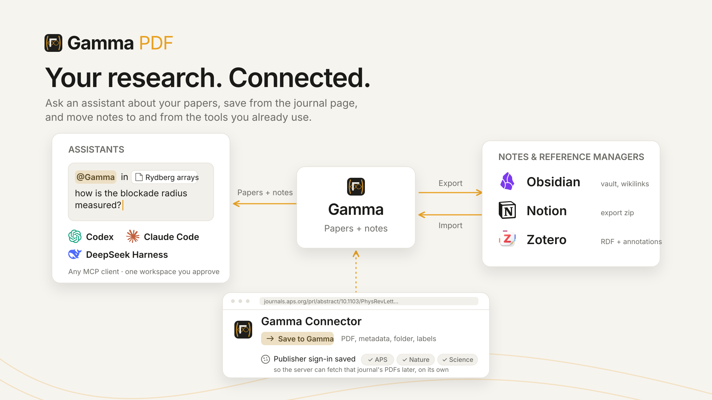

# Gamma user guide

Everything you can do in Gamma, one section per part of the app. The [README](../README.md) covers installing it; the section links there land here.

**Contents:** [Getting started](#getting-started) · [Reading and highlighting](#reading-and-highlighting) · [Notes](#notes) · [AI chat](#ai-chat) · [Library and organization](#library-and-organization) · [Search](#search) · [Metadata and citations](#metadata-and-citations) · [Sharing a page](#sharing-a-page) · [Workspaces](#workspaces) · [Offline copies](#offline-copies) · [Gamma Connector](#gamma-connector) · [Assistants: Codex and Claude Code](#assistants-codex-and-claude-code) · [Import and export](#import-and-export) · [Backups](#backups) · [Install as an app](#install-as-an-app) · [Panels, tabs and navigation](#panels-tabs-and-navigation) · [Settings at a glance](#settings-at-a-glance) · [Shortcut cheat sheet](#shortcut-cheat-sheet)

## Getting started

1. **Sign in.** Your administrator gives you an account, or click **Log in as guest** to try things out (guest data resets daily).
2. **Add a paper.** Click **+** in the top bar and paste any link — an arXiv page, a DOI, or a publisher page; Gamma finds the PDF (and falls back to a legal open-access copy via Unpaywall when the DOI is paywalled). Or upload PDFs, or **drag files or whole folders into the window** — subfolders become library folders.
3. **Read it.** The paper opens with a Notes panel beside it. Select text to highlight, type under the highlight to comment. That's a note; everything else builds on that.

**New page** creates a page without a PDF (a plain notebook page). The paperclip on any page attaches a PDF later, or detaches it.

On open, each paper's title, authors and venue are filled in automatically (arXiv → DOI → AI), see [Metadata and citations](#metadata-and-citations).

**Guided tours.** The account menu (top right) → **Tours** lists **Your first paper** and **AI chat** — short walkthroughs that point at the real controls and wait for you to try them.

## Reading and highlighting

- **Highlight**: select text with the mouse → a small popup offers four colors. Pick one and the highlight becomes a note block, already focused so you can type a comment. The chain button in the same popup links the selection to another paper or a URL instead.
- **Area highlight / screenshot**: **hold Ctrl and drag a rectangle** on the page. Two things happen at once: the region is cropped as an image and attached to the AI chat (ready to ask about a figure or table), and the color popup appears — pick a color to also keep it as a rectangular highlight whose note card shows a thumbnail of the region. On a phone there is no Ctrl — use the text/rectangle mode toggle in the zoom column.
- **Click a highlight** to jump to its note (and quote it into the chat). **Right-click** it to recolor, link it to a paper, copy it as a reference point (also copies a deep link to the exact passage), or delete it. Highlights with a comment carry a small **speech-bubble badge** — hover it to read the note in place.
- **Highlights already in the file** (made in Acrobat, Preview, SumatraPDF…) are imported as blocks when the paper is added; Settings → Reading & editing decides whether the embedded copies are kept or stripped from the stored PDF so nothing renders twice.
- **Zoom**: Ctrl+wheel (anchored at the cursor), pinch on touch, or the +/−/fit buttons on the right edge. Zoom and reading position are remembered per paper and synced across your devices.
- **Dark pages**: Settings → Appearance → *Flip page colors* inverts the page for night reading (display only; the PDF is untouched).

### Draw with a pen

The pen button in the viewer's zoom column opens the tool strip: pens and highlighters with their own colors and widths, an eraser (whole strokes or partial), a lasso to move, resize, rotate, recolor, duplicate or delete strokes, and Undo / Redo.

Tap an active pen preset again to choose **Pen** (width follows stylus pressure) or **Monoline** (an even line at every pressure). Each preset remembers its style, color, and width. Highlighters stay translucent and constant-width.

- A **stylus** (Apple Pencil, Surface Pen, Wacom) draws right away even with the strip closed, with pressure, while fingers keep scrolling and pinching; tap ink to select it. The mouse draws once the strip is open. Settings → Reading & editing → *Draws with* chooses pen only or pen and finger.
- The strokes on a page become **one block in the notes**, with your caption under it; *New group* starts another block. Ink is exported and imported with the notes like any other block.

### Links inside the PDF

- **Citations and internal links are clickable**: a link within the document jumps there; a citation to a paper already in your library opens that paper; otherwise you are offered *Fetch into Gamma* (arXiv / DOI) or *Open in browser*.
- **Back** (top bar, or **Alt+←**) unwinds jumps with their exact scroll positions, across documents too. Right-click it to clear the stack.
- You can also **link a citation to a paper you already have**: right-click a highlight → link it to a page, or to an exact highlight in that page.

### Translate a paper

- **The 文A button** in the zoom column translates the page you are reading, in place. Each paragraph is redrawn in your language over the original; figures and layout stay put. Hold **Alt** to peek at the original.
- On a translated page the button hides or shows the translation (all pages at once). On a page not yet translated, it translates that page.
- **Right-click** the button (long-press on touch) for *Translate whole document*. The pages nearest you come first; a click on the button stops the job.
- **Translate a selection**: select text and click 文A in the highlight popup. The translation opens under the colors, with a copy button. Turn on *Translate on select* to skip the click.
- **What translates** is Settings → Reading & editing → Translation → *Translate with*: a chat model, or a translation service.
  - **Microsoft (free)** works with no setup, and is the default when you have no AI connection. It is unofficial and could stop working; if it keeps failing, a dot on the account button leads to the row that says why.
  - **Google Cloud Translation** and **Youdao** need your own key, added in the same section.
  - A chat model keeps formulas and citation markers intact; a service is faster and costs less per page.
- The target language, the selection options and the speed (parallel requests) are in the same section.

## Notes

Notes live in the **Notes panel** as a nested outline. Highlights and free notes are the same kind of block, so a paper's notes and a plain page are edited the same way.

- **Editing**: Enter inserts a line break, **Shift+Enter starts a new note** (swap the two in Settings → Reading & editing). **Tab / Shift+Tab** indent and outdent. Backspace in an empty note deletes it. Drag the **⋮⋮ handle** to reorder or re-nest; the **+** under it makes a new block below. Clicking a note opens it with the cursor on the character you clicked, and the page scrolls so that spot stays under the pointer. Hover the gap between two paragraphs, formulas or lists inside a note and a line appears; click it to start a new line there.
- **Live rendering, Obsidian-style**: the block you are on stays raw; everything else renders — headings, bold/italic/code/strike, `==highlight==`, bullets, todos, quotes, `> [!note]` callouts, tables, code fences with syntax colors, images, and links.
- **Math**: `$…$` inline and `$$…$$` display math render with KaTeX. While typing, a live preview floats over the raw source, brackets are pair-colored, `\command` autocompletes, and **Tab hops between `{}` arguments**. `$` auto-pairs; type `\begin{` to complete an environment.
- **Pictures**: paste a screenshot or drag an image into a note. Pictures sit centred; hover one for zoom, caption, download and delete, and **drag the grip on either side** to resize (stored Obsidian-style as ``).
- **Tables** are edited in place: click a cell to edit, Tab hops cells, hover strips add rows and columns, handles move them by drag, and every edit auto-formats the markdown.
- **Formatting keys** are Obsidian's: Ctrl+B / I / E / Shift+X / Shift+H toggle bold, italic, code, strike and highlight; Ctrl+K makes a link and fills it from a URL on the clipboard.
- **Block commands**: Ctrl+Shift+K deletes the line (a one-line note as a whole, its children staying), ↑/↓ on a note's first or last line step into the neighbour, and **Ctrl+Shift+P** runs the rest by name — move or duplicate a note, new note above, indent, collapse, toggle a to-do, select its text. Give any of them keys in Settings → Keyboard, where every shortcut is listed and changeable. The full list: [Shortcut cheat sheet](#shortcut-cheat-sheet).
- **`[[` links** between notes and pages, with autocomplete; inserted references are clickable chips, and a **Backlinks** section shows who links here. `![[block]]` **embeds** show the source block and let you edit it right there.
- **"/" menu**: type `/` for headings, callouts, code, colored text, and everything else.
- **Paste**: URLs offer *link / mention / embed*; multi-line text offers *Text / Blocks* (Blocks parses markdown into an outline); a table from Excel or Sheets pastes as a markdown table.
- **Highlights and notes are linked both ways**: click a note to jump the PDF to its highlight; click a highlight to jump to its note. Ctrl+click a note's card to add its quote to the chat. An existing note can be attached to a highlight later: the **⊕** on its row starts attach mode — then click the highlight.
- **Undo** is one history for the whole page; Ctrl+Z inside an open editor restores the text in place with the cursor where the change was.
- Copying rendered notes keeps the formatting: math comes out as LaTeX source, rich text pastes into Word or PowerPoint.

## AI chat

Open the chat from the **⋮ menu → AI Chat**. Configure providers in Settings → AI → Connections: Anthropic or OpenAI keys, any OpenAI-compatible gateway, or sign in with your **ChatGPT subscription** (no API key). Keys are stored per account on the server and never shown to the browser again.

- **Enter sends**, Shift+Enter is a newline. The **model and effort switchers** are in the panel header. A mic button dictates into the input.
- **Context**: in a paper the chat reads that paper's text automatically. The **PDF toggle** attaches the actual file (so the model sees figures and tables); it turns itself off once the file has been sent in a conversation, to avoid re-billing it every message.
- **Add more**: paste images, Ctrl+drag a region of the page (see [Reading](#reading-and-highlighting)), type **`@`** to attach another paper from your library, or use the **+ menu** to attach files or pick several papers (optionally with your notes and highlights).
- **Quote passages**: click a highlight to set the chat's "Selection"; Ctrl+click more highlights to add up to six passages.
- **Change just part of a note**: drag across a note's text — the note opens and the drag selects, and the chat's chip becomes **Selection**. Ask for the change ("make this more concise", "translate this") and the assistant rewrites only the selected text, never the rest of the note. Hold Ctrl while dragging to select without opening the note and to collect several passages.
- **Citations are clickable**: an answer's `p. 12` link jumps the PDF to the quoted passage and highlights it.
- **Token counts**: a dim line under each reply shows ↑ tokens sent, ↓ tokens received, and how much the provider served from its cache. Settings → AI → Connections → **Token usage** totals today, the week and the month per model.
- Per message: **copy**, **edit & re-send** (discards the replies after it), and a **stop** button while streaming. **Ctrl+F inside the panel** finds text in the conversation.
- Each paper and each folder keeps its own conversation; **New chat** starts over. Chats in a shared workspace are visible to its members.

### The library agent

On the home page or in a folder, the chat can act on your library: list, read and search the papers in view, compare findings, rename pages, file them into folders — *"rename these to AuthorYear style"*, *"which of these measure T1?"*. It can also search the web for papers (Crossref, arXiv) and read a document by DOI, arXiv id or URL.

Every tool call shows as a chip you can expand to see exactly what it did, with its arguments and result. Permissions are per tool in Settings → AI → Chat, and the agent can never delete anything or edit your notes. Details: [the agent tools guide](dev/ai_tools.md).

## Library and organization

The home page is a recents feed of all your pages, with a **Recently viewed** strip on top (its cards show a snapshot of where you left off — click × to remove one).

- **Folders** are paths: drop a paper into `qc/neutral-atom` and the hierarchy builds itself — a **qc** folder with a **neutral-atom** subfolder; add `qc/superconducting` and the sibling appears. A paper can live in several folders at once (dragging onto a folder *adds* it there). Drop a paper on the **back row** inside a folder to take it out; drag a folder onto another folder to move its whole subtree.
- **Labels** are flat tags for cross-cutting facets (an author, a keyword); a paper can carry several, and each is one click to filter by. Edit both from the label row under a paper's title: type `name/` for a folder, anything else for a label.
- **Selection works like a file manager**: click selects, Ctrl+click toggles, Shift+click extends, **double-click opens**, Escape clears. Right-click for Open / Rename / Pin / Duplicate / **Move to folder** (a flyout with checkmarks) / Delete — acting on a multi-selection applies to all of it. A folder's menu adds **Export…** for everything inside it.
- **Sort** (modified / added / viewed / title) is remembered per folder; toggles switch grid/list and folders/files. Pin papers to keep them in a strip at the top. Card strips scroll sideways with a plain mouse wheel.
- **Files inside notes**: any upload (a PDF, a markdown file, a dataset) dropped on a block becomes a small file card. Right-click a PDF or markdown card → *Add to library* turns it into a page of its own.

## Search

**Ctrl+F** searches everything at once: page titles, this paper's notes, this PDF's text, other notes, reference links, and the full text of every PDF in the library — with match-case, whole-word and regex toggles.

- **Filter chips**: type a label or folder name and press Tab — label chips match exactly, folder chips include everything beneath them (`qc` pulls in `qc/neutral-atom`).
- **Ctrl+P** is the quick way to another page: a palette listing your recent pages, filtered by title, folder or label as you type (small typos are forgiven, like the library's search box) — ↑↓ and Enter open it.
- **Enter / Shift+Enter** step through matches; the chevron collapses the result lists into a compact find bar (make that the default in Settings → Reading & editing).
- Matching is forgiving: "3000" finds "3,000-qubit", even across a line break. Opening a library hit loads the paper and scrolls to the highlighted match.

## Metadata and citations

- The **(i) button** in the Notes panel's title row opens the metadata popover: title, authors, venue, year, DOI, arXiv — all editable (Enter saves), with **↻ refetch**, an AI title-fill button, and a health check of the extracted PDF text (with a preview of what the AI actually reads).
- The share popover holds the **BibTeX** entry and a slide-ready **citation** that pastes into PowerPoint with real italics, each with a copy button.
- Settings → Library maintenance shows a per-paper metadata and search-index health table with batch retry.

## Sharing a page

The **link button** in the top bar shares the open page, Notion-style:

- **Who**: *anyone with the link*, *signed-in users*, or *invited people only* — plus a **View / Edit** toggle for that audience.
- **Invite** people by name, each with their own view or edit right. Members of the workspace keep their workspace role on top.
- Viewers see the PDF, highlights and notes, no login needed; editors edit alongside you, with live cursors. A visitor editing through an anyone-with-the-link share is asked for a display name.
- **Stop sharing** ends the link; share again for a new one. Copied links carry the workspace, so a teammate opening one lands in the right library.

## Workspaces

A workspace is a separate library — its own pages, PDFs and chats. Your account starts with a personal one; the account menu (top right) lists every workspace you belong to and switches between them; **Workspaces…** opens Settings → Workspaces.

- **Personal workspaces**: create more for separate projects (papers vs. reading). Only you can see them; their storage counts against your quota.
- **Shared workspaces** are created by a server administrator (Settings → Server). Members are **owners** (manage members, rename, delete), **editors** (change pages) or **viewers** (read everything, change nothing). A shared workspace can additionally be *public*: anyone signed in on the server can read it.
- **Edit together**: changes and cursors appear live; edits to different blocks coexist; two people typing into the same block merge by span, and the server keeps the last write when they touch the same characters.
- **Tabs follow you**: open tabs, the recents strip, pinned folders and reading positions sync per account and workspace, so a phone and a desktop pick up where the other left off.
- In the desktop app the toolbar's switcher lists the open server's workspaces, then the servers themselves.

## Offline copies

Your library lives on your server and opens from any browser — the office desktop, the iPad, a phone. For the places without a connection (the train, a flight, a lab without Wi-Fi) keep an **offline copy**: a workspace on a Gamma that runs on your own laptop, holding a full copy of a workspace on the server, and keeping the two in step by itself.

- **What travels**: every page with its blocks, highlights, ink and files (PDFs and images, by content hash — a file is transferred once), folders and labels, metadata. Not synced: reading positions and open tabs (per device), chats, search indexes (the copy builds its own).
- **How it syncs**: a *round* asks both sides what changed since the last one and reconciles each page three ways — the server's changes are applied to the copy, the copy's changes are pushed to the server. Rounds run on a cadence you choose (*Live*, 30 s, 5 min or manual) and, if you like, right after you edit. Nothing waits on a connection: edits made offline simply go with the next round that reaches the server.
- **Merging**: edits to different blocks never conflict. Two edits to the same block merge by span; an edit beats a delete (a subtree deleted on one side comes back if the other side wrote into it). When both sides changed the same words, the sync keeps a merged text and marks the block with a **merge chip** — click it to see local, remote and merged side by side as a word diff and pick one; nothing is lost silently.
- **The sync pill** in the page header shows the copy's state at a glance — spinning during a round, a dot for edits not synced yet, green when up to date, a count when conflicts wait. Click it for the log of what each round pulled and pushed (`+3 −1 ~2` blocks per page, each row expandable to a diff), *Sync now*, and the gear with the copy's settings: cadence, *Sync after an edit*, direction (*Two-way* or *Receive only*), force pull / force push, detach / reattach, remove origin.

**Making one**

- **Desktop app** (the easy way): open the remote server, open the workspace switcher, and click the **clone** chip on the workspace's row. The app creates a local server if needed, sets up the copy and opens it; from then on it syncs in the background whichever server the window shows, and the row's chip reads *open clone*.
- **Any Gamma**: on the *server*, make a **read-and-write token** in Settings → AI → Integrations. On the Gamma that will hold the copy, Settings → Account & sync → **Clones → Clone a remote workspace**: the server's address, the token, a name, and the direction. You can also clone *into* an existing workspace (say, one restored from a backup); pages that exist on both sides adopt the server's version and differing blocks become conflicts to resolve.

A copy can be **detached** (it stops syncing and behaves like an ordinary workspace, keeping everything) and **reattached** later — the next round merges what both sides did meanwhile. **Remove origin** drops the link and keeps the workspace. Settings → Account & sync → Clones lists every copy with its state, conflicts and these actions.

## Gamma Connector

The browser extension saves the paper you are reading, in one click, straight from the arXiv / DOI / publisher tab: PDF, metadata, folder and labels. Install: download `gamma-connector-<version>.zip` from the [releases](https://github.com/tim4431/Gamma/releases), unzip, then `chrome://extensions` → *Developer mode* → *Load unpacked*.

- **Set up**: the popup asks for your server's address and signs in with your Gamma account (the same session cookie as the app).
- **Save**: the toolbar badge lights up on a page with a paper. Click it → pick a folder and labels → **Save to Gamma**. **Ctrl+Shift+S** saves with the default folder. If the paper is already in your library the badge shows a ✓ and the popup offers *Open in Gamma* or *Add to another folder…* instead of a duplicate.
- **Clip**: right-click → *Save link to Gamma*, *Save page to Gamma*, or *Clip selection to Gamma* (the selection becomes a quote block under the paper this tab matches, else under a "Web clips" page).
- **Options**: server address, sign in / out, default folder and labels, *prefer open-access fallback*, *keep a PDF copy*, and automatic refresh of publisher sign-ins.

### Publisher sign-ins

Many journal PDFs need a subscription your browser has (through the campus network or a login) but your server does not. The **cookie button** in the popup's footer fixes that: on a supported journal site it offers to send your browser's sign-in for *that host* to your Gamma account. From then on the *server* can download that journal's PDFs on its own — when you save from the extension, when the AI agent fetches a cited paper, or when a paper is added by DOI. One sign-in per publisher, refreshed automatically while you keep visiting the site; the drawer lists the connected publishers and disconnects any of them. Cookies are stored encrypted on the server and never shown again; the server must be reached over HTTPS (or localhost).

## Assistants: Codex and Claude Code

Codex, Claude Code, DeepSeek Harness and any other MCP client can search and read your papers, notes, highlights and PDF text — read-only, for one workspace you approve in the browser. Then, in the assistant: *"@Gamma, in the Rydberg arrays paper, how is the blockade radius measured?"*, or paste a Gamma page or share link with your question.

- **Codex**: Settings → AI → Integrations → **Codex CLI**, pick your operating system, copy the one setup command and run it on the computer where you use Codex. It installs the Gamma plugin from a published release and opens Gamma sign-in; approve the workspace and start a new chat. Invoke `$gamma` in the CLI or pick Gamma from the plugin picker.
- **Claude Code**: the same panel shows the connection command (`claude mcp add --transport http gamma <your-address>/mcp`); the plugin setup is in [plugins/gamma](../plugins/gamma/README.md). Sign in through `/mcp`, then run `/gamma:gamma` or just ask.
- **DeepSeek Harness**: Settings → AI → Integrations → **DeepSeek Harness**. Create a read-only token (dsh has no browser sign-in), run the install command, which adds the Gamma plugin to dsh's web profile (needs pnpm), then start dsh with the start command and paste the token when asked. Gamma's tools appear as `mcp__gamma__…`; paste a Gamma page link with your question.
- **Other MCP clients** use the server URL shown in the panel; sign in happens in the browser. Manual tokens are there for clients that cannot.
- For a Gamma hosted remotely an administrator confirms the **Public server URL** once in Settings → Server, which enables assistant sign-in; no environment variables or restart.

The panel lists every connected assistant with how it signed in and lets you disconnect it. Details: [docs/dev/mcp.md](dev/mcp.md).

## Import and export

Both live in the **⋮ menu**, on a page or on the home library (with a folder open, Export takes the whole folder).

**Import…**

- **Annotations embedded in the open PDF** (Acrobat, Preview, SumatraPDF…) as highlight blocks; the *strip* switch rewrites the stored PDF without them so nothing renders twice.
- **Zotero library**: File → Export Library as Zotero RDF with files and notes, zipped — collections become folders, tags become labels, reader annotations become highlights.
- **Logseq**: a `.pdf + .edn` pair with its highlights.
- **Markdown notes**: one `.md`, or a `.zip` of a folder — an **Obsidian vault** (wikilinks, block embeds, tags and image sizes survive) or a **Notion export** — comes in as note pages, folders included.
- **A Gamma export** zip from another Gamma merges into this workspace (pages are matched by id, files by hash — re-importing never duplicates).

**Export…**

- **Annotated PDF**: highlights become real PDF annotations; notes can be drawn onto the page with leader lines — math, CJK and images included.
- **Notes as PDF** or **Markdown** (highlights as quotes, images bundled or linked).
- **Obsidian vault** (wikilinks, `^id` block anchors, highlights as quote callouts linking the PDF page), **Logseq graph**, **Zotero library** (RDF with PDFs and annotations, ready to import), or a **Gamma zip** another Gamma can merge.
- Switches choose the layers (highlights, notes, bundle the files); the last choice is remembered.

## Backups

- **A workspace**: Settings → Workspaces → the row's *Data* menu → **Export** downloads a zip (pages, notes, highlights, uploaded PDFs); **Import** there restores or merges it. **Export all** takes every personal workspace at once.
- **Snapshots**: Settings → Backups keeps server-side snapshots per workspace you can roll back to.
- **The whole server** (administrators): Settings → Server → *Server backups* snapshots every account and workspace; restore with the server stopped (`manage.py backups --restore`).

Account credentials and private AI keys are never part of an export.

## Install as an app

Gamma is a web app; install it from the browser so it opens from an icon, full screen, pointed at your server.

- **iPad / iPhone**: open your Gamma address in Safari, Share → **Add to Home Screen**. You may be asked to sign in once more (the installed app keeps its own cookies). The Apple Pencil writes on papers right away, with pressure, while fingers scroll and pinch.
- **Android**: Chrome → ⋮ → **Install app**.
- **Windows / macOS / Linux**: in Chrome or Edge, the install icon at the right end of the address bar, or **Install Gamma** from the browser menu.

The installed web app still needs the server to be reachable. For a library that works with no connection at all, use the **desktop app** with an [offline copy](#offline-copies): it runs a local Gamma on your disk, opens your servers as well, and switches between them from its toolbar. Get it from the [Microsoft Store](https://apps.microsoft.com/detail/9N8WGWR2J2MV) or the [releases](https://github.com/tim4431/Gamma/releases/latest) (Windows installer, macOS dmg, Debian/Ubuntu deb).

## Panels, tabs and navigation

- The Notes and Chat windows are dockable: **drag the ⠿ grip** to dock them left, right or bottom (the drop position decides the order); **double-click the grip to collapse** a window to its header bar and back; **×** closes it (reopen from the ⋮ menu). Drag the dividers to resize. Each paper remembers its own layout.
- **Tabs** sync to your account across devices. Middle-click closes a tab; right-click pins it (pinned tabs stay left and can't be middle-closed); drag to reorder.
- **Background tasks** (uploads, fetches, exports) show in the top bar's tasks popover with progress.
- On a phone everything becomes full-screen views behind a bottom tab bar (Library/PDF · Notes · Chat).

## Report a problem

Something broke? Open the account menu and choose **Report a problem…** (it is also under Settings → Diagnostics → Help). Say what happened and, if you know, how to bring it back. Gamma adds what a maintainer needs to reproduce it: which build the server runs, your browser and screen, what kind of view was open, and the app's own recent log lines — never your notes, files or names, and any secret-looking text is masked; the preview shows exactly what goes out. **Record…** captures your screen while you show the problem (the dialog shrinks to a small pill with a Stop button; up to three minutes, no sound); the recording is saved to your downloads and you drop it into the GitHub form. **Open GitHub issue** opens the bug form with everything filled in for you to review before posting, and copies the same report to your clipboard; **Copy report** is for sending it any other way.

## Settings at a glance

Settings (account menu → Settings) has one sidebar in three groups; the search box at the top finds any setting by name.

| Group | Pane | What's there |
|---|---|---|
| Preferences | Appearance | Theme (system + seven), language, flip page colors, library cards (thumbnails / folders / labels), interface size, tour suggestions |
| | Reading & editing | PDFs (imported annotations, open-access fallback, metadata auto-fetch, saving external PDFs), handwriting (pen only / pen and finger, pressure), translation (button, language, selection, model or service and its keys, speed), the Enter key, how search opens |
| | Keyboard | Every shortcut, rebindable |
| | Account & sync | Your account, storage meter and Gamma Cloud link; **Settings sync** (*Sync now*, *Fetch from cloud*, *Push to cloud*); published pages, **Clones** (offline copies) and the sync pill |
| AI | Connections | Providers and keys, ChatGPT sign-in, default models, token usage |
| | Chat | Default reasoning effort, snapshot clearing, which tools the agent may use per chat kind |
| | Advanced | Tool limits, context budgets |
| | Prompts | The system prompts |
| | Integrations | Codex / Claude Code / DeepSeek Harness / MCP connections and tokens |
| Manage | Workspaces | Personal and shared workspaces, export / import |
| | Backups | Server-side snapshots |
| | Library maintenance | Storage, search-index rebuild, metadata health table |
| | Users, Server | Administrators: accounts, the dashboard, public URL, storage defaults, shared workspaces, server backups, the log |
| | Diagnostics | This browser's session log, debug tracing, Report a problem |

Preferences apply immediately; browser-only ones (theme, layout) are marked *This browser*, the rest sync with your account.

## Shortcut cheat sheet

**Ctrl+Shift+P** runs any command by name — exporting, sharing, importing, moving or duplicating a note, and more — whether or not it has keys. **Settings → Keyboard** lists every command: click the keys to change them, press new ones, Backspace unbinds; a command without keys gets some the same way. On a Mac, Ctrl is ⌘ and Alt is ⌥.

| Keys | Does |
|---|---|
| Ctrl+F / Ctrl+Shift+F | Search everything (find-in-chat when the chat is focused; on the home page, the listing's box) / always the full panel |
| Ctrl+P | Quick open: pick a page by title, folder or label (recent pages first) |
| Ctrl+Shift+P | Command palette: every command by name, with its keys (also `>` typed into Ctrl+P) |
| F2 | Rename the page |
| Ctrl+Z / Ctrl+Y (or Ctrl+Shift+Z) | Undo / redo, one history per page |
| Alt+← | Back through link jumps |
| Enter / Shift+Enter | In search: next / previous match. In notes: line break / new note (swappable). In chat: send / newline |
| Tab / Shift+Tab | Indent / outdent a note · accept a search filter chip · hop between `{}` arguments in math · hop table cells |
| ↑ / ↓ | On the first / last line of a note: move into the note above / below |
| Ctrl+Shift+K | Delete the line (a one-line note goes as a whole; its children stay) |
| ← / → | At the text's edge: collapse / expand the note's children |
| Ctrl+B / Ctrl+I / Ctrl+E / Ctrl+Shift+X / Ctrl+Shift+H | Bold / italic / code / strike / highlight |
| Ctrl+K | Link the selection (fills the URL from the clipboard) |
| Backspace | On an empty note: delete it |
| `/` · `[[` · `@` | Command menu in a note · page link · attach a paper in chat |
| Ctrl+wheel | Zoom the PDF at the cursor |
| Ctrl+drag on the page | Capture a region → chat image + optional area highlight |
| Ctrl+click a highlight | Add its quote to the chat selection |
| Ctrl+drag across note text | Attach that passage to the chat — the assistant edits only it |
| Double-click | Open a library card · collapse/expand a window (on its grip) |
| Middle-click a tab | Close it (pinned tabs are protected) |
| Ctrl+Shift+S | In the browser extension: save this page to Gamma |
| Esc | Close popups, clear selections, cancel modes |
