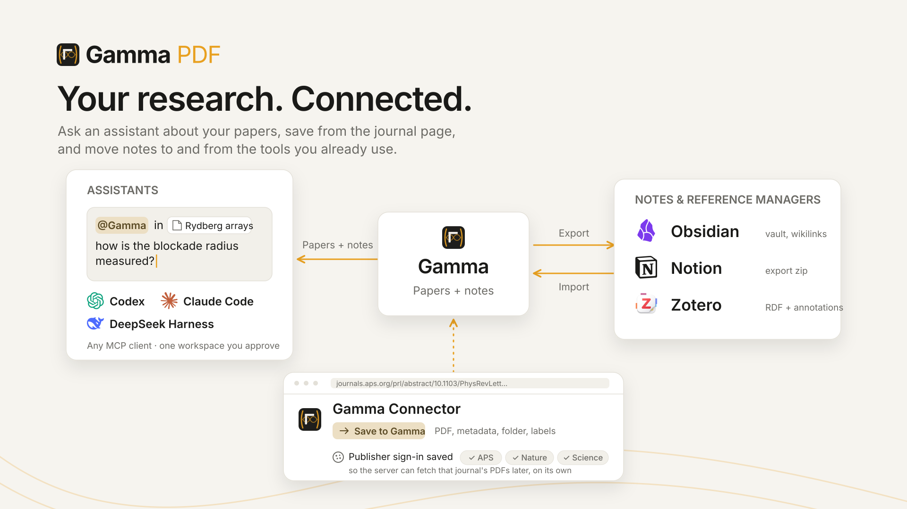

# Gamma user guide

Everything you can do in Gamma, one section per part of the app. The [README](../README.md) covers installing it; the section links there land here.

**Contents:** [Getting started](#getting-started) · [Reading and highlighting](#reading-and-highlighting) · [Notes](#notes) · [AI chat](#ai-chat) · [Library and organization](#library-and-organization) · [Search](#search) · [Metadata and citations](#metadata-and-citations) · [Sharing a page](#sharing-a-page) · [Workspaces](#workspaces) · [Offline copies](#offline-copies) · [Gamma Connector](#gamma-connector) · [Assistants: Codex and Claude Code](#assistants-codex-and-claude-code) · [Import and export](#import-and-export) · [Backups](#backups) · [Upgrading](#upgrading) · [Install as an app](#install-as-an-app) · [Panels, tabs and navigation](#panels-tabs-and-navigation) · [Report a problem](#report-a-problem) · [Settings at a glance](#settings-at-a-glance) · [Shortcut cheat sheet](#shortcut-cheat-sheet)

## Getting started

1. **Sign in.** Your administrator gives you an account, or, where the server allows guests, click **Continue as guest** (**Try the demo** on a demo server) to try things out: you get a workspace of your own that is deleted with everything in it after a while (a day unless the admin changed it; the guest button says how long and the account menu says when).
2. **Add a paper.** Click **+** in the top bar and paste any link — an arXiv page, a DOI, or a publisher page; Gamma finds the PDF (and falls back to a legal open-access copy via Unpaywall when the DOI is paywalled). Or upload PDFs, or **drag files or whole folders into the window** — subfolders become library folders.
3. **Read it.** The paper opens with a Notes panel beside it. Select text to highlight, type under the highlight to comment. That's a note; everything else builds on that.

A new account starts with a **Welcome** page: the first steps in short, with a sample PDF of the same text to practise highlighting on. Delete it whenever you like.

**New page** creates a page without a PDF (a plain notebook page). The paperclip on any page attaches a PDF later, or detaches it.

On open, each paper's title, authors and venue are filled in automatically (arXiv → DOI → AI), see [Metadata and citations](#metadata-and-citations).

**Guided tours.** The account menu (top right) → **Tours** lists the tours that fit where you are: **Your first paper** and **AI chat** anywhere, **Sharing a page** and **Editing tables** on a page, **Handwriting** and **The PDF viewer** on a PDF, **The notebook view** in a notebook's viewer — short walkthroughs that show each move on the real controls; try it yourself, or press Next to go on. A new, empty library is offered **Your first paper** when you arrive. Short tips and tour offers also appear right after you first use a feature, saying what just happened; turn them off in Settings → Appearance → **Suggest tours**.

## Reading and highlighting

- **Highlight**: select text with the mouse → a small popup offers four colors. Pick one and the highlight becomes a note block, already focused so you can type a comment. The chain button in the same popup links the selection to another paper or a URL instead.
- **Area highlight / screenshot**: **hold Ctrl and drag a rectangle** on the page. Two things happen at once: the region is cropped as an image and attached to the AI chat (ready to ask about a figure or table), and the color popup appears — pick a color to also keep it as a rectangular highlight whose note card shows a thumbnail of the region. On a phone there is no Ctrl — use the text/rectangle mode toggle in the zoom column.
- **Click a highlight** to jump to its note (and quote it into the chat). **Right-click** it to recolor, link it to a paper, copy it as a reference point (also copies a deep link to the exact passage), or delete it. Highlights with a comment carry a small **speech-bubble badge** — hover it to read the note in place.
- **Highlights already in the file** (made in Acrobat, Preview, SumatraPDF…) are imported as blocks when the paper is added; by default the embedded copies are then removed from the stored PDF, so nothing renders twice and a highlight you delete is gone from exports too. Settings → Reading & editing → *Imported annotations* → *Keep originals* leaves the file as it came instead.
- **Zoom**: Ctrl+wheel (anchored at the cursor), pinch on touch, or the zoom buttons in the viewer's controls on its left edge (−, +, fit width). Zoom and reading position are remembered per paper and synced across your devices.
- **Dark pages**: Settings → Appearance → *Dark PDF pages* inverts the page for night reading (display only; the PDF is untouched).

### Draw with a pen

The pen button in the viewer's zoom column opens the tool strip: pens and highlighters with their own colors and widths, an eraser (whole strokes or partial), a lasso to move, resize, rotate, recolor, duplicate or delete strokes, the **Text** tool for [typed text](#type-on-the-page), and Undo / Redo.

Tap an active pen preset again to choose **Pen** (width follows stylus pressure) or **Monoline** (an even line at every pressure). Each preset remembers its style, color, and width. Highlighters stay translucent and constant-width.

- A **stylus** (Apple Pencil, Surface Pen, Wacom) draws right away even with the strip closed, with pressure, while fingers keep scrolling and pinching; tap ink to select it. The mouse draws once the strip is open. Settings → Reading & editing → *Draws with* chooses pen only or pen and finger.
- The strokes on a page become **one block in the notes**, with your caption under it; *New group* starts another block. Ink is exported and imported with the notes like any other block.
- **Replay**: the play button in the corner of a handwriting card in the notes shows the strokes being written again on the page (it scrolls there) and in the card, in the order and at the pace you wrote them (long pauses are shortened). Press it again to stop.
- **Transcribe with AI**: in a handwriting block's ⋮⋮ menu. The chat reads the strokes and writes them out as text in the block's caption; like any change, it asks first unless **Edit note blocks** is set to Allow. Math comes out as LaTeX, and a word it can't read is marked *[illegible]*. With **Edit note blocks** Off it answers in the chat instead. You can also ask the chat about your handwriting: it looks at the strokes where you wrote them.
- Two people, or two of your devices, drawing in the same block keep both drawings: the strokes merge instead of one side replacing the other.

### Type on the page

The strip's **Text** tool (**T** while the strip is open) puts typed text on a PDF page or a notebook sheet, like a text box in Acrobat.

- **Add a box**: arm Text and tap where the text should start, then type. Drag instead to set the box's width first; the text then wraps inside it. Esc or a click elsewhere finishes. A box you leave empty goes away.
- **Type**: Enter starts a new line in the box. The note formatting keys work (Ctrl+B, Ctrl+I, Ctrl+K…), and so does Markdown: lists, headings, math.
- **Select and move**: with the hand (or the strip closed), click a box to select it and click it again to edit it. Drag a box to move it. On a touch screen, tap a box first, then drag it; a finger on a box that isn't selected scrolls the page. A selected box's keys: the arrows nudge it (Shift for bigger steps), Delete removes it, Enter edits it, Esc lets go.
- **Resize**: drag the handle on the right edge of a selected box to set its width.
- **Style**: a selected box has a menu with its **Size**, **Color** and **Background**, **Duplicate**, **Show note** and **Delete**. Tap the armed Text tool again for its options: the size, color and background of new boxes, which also restyle the selected box or the one you are typing in.
- **In the notes** each box is a note with a **T** marker; click the marker to see the box on its page. Edit the text in either place.
- **Undo**: while Text is armed or a box is selected, Ctrl+Z and the strip's Undo take back changes to the boxes (and your notes), a run of nudges in one step; with a pen armed they take back strokes. On a shared page, someone moving a box while you type in it keeps both, and your undo takes back only yours.
- Boxes export with your notes, a box on a PDF page with its page number, and as real text boxes in **Annotated PDF**. Text boxes and sticky notes made in other PDF apps come in as boxes.

### Notebooks

A notebook is a page with sheets of blank paper to write on, like a Notability note, and any page can become one: its sheets sit among its notes. Write on them with the same pens and highlighters as on a PDF, and type on them with the Text tool.

- **+ → New notebook** makes a page with one sheet and opens it in the notebook view. In any page, type **/note** in a block (an empty block becomes the sheet; otherwise the sheet goes right after it), or choose **Add page below** from a block's handle menu.
- **Two views.** The notes view draws each sheet right among your notes, with its tools under it: its pen, its **Paper**, a replay of what's written on it, **+** for another sheet after it, and **Notebook view**, which shows the sheets large in the viewer instead, with your notes beside them. **Notes view** in the viewer's side bar, or closing the viewer, goes back. Each page remembers its view in this browser.
- Writing near the bottom of the last sheet adds the next one, so there is always paper below. **Add page** at the end of the notebook view adds one too. A new sheet takes the paper of the sheet before it.
- **Paper** sets a sheet's size (A4, Letter, A5), orientation, pattern (blank, ruled, grid, dots), line spacing and background; *Apply to all pages* gives every sheet that paper.
- The notes list the sheets ("Page 1", or a title you type). A sheet's handwriting is folded under it; unfold it to see the drawings as cards. Notes you type under a sheet are about that page.
- **Export → Annotated PDF** gives the sheets as a PDF.
- On the iPad a page with sheets opens in the notebook view, with the notes beside them.

### Links inside the PDF

- **Citations and internal links are clickable**: a link within the document jumps there; a citation to a paper already in your library opens that paper; otherwise you are offered *Fetch into Gamma* (arXiv / DOI) or *Open in browser*.
- **Back** (top bar, or **Alt+←**) unwinds jumps with their exact scroll positions, across documents too. Right-click it to clear the stack.
- You can also **link a citation to a paper you already have**: right-click a highlight → link it to a page, or to an exact highlight in that page.

### Translate a paper

- **The 文A button** in the zoom column translates the page you are reading, in place. Each paragraph is redrawn in your language over the original; figures and layout stay put. Hold **Alt** to peek at the original.
- On a translated page the button hides or shows the translation (all pages at once). On a page not yet translated, it translates that page.
- **Right-click** the button (long-press on touch) for *Translate whole document*. The pages nearest you come first; a click on the button stops the job.
- **Translate a selection**: select text and click 文A in the highlight popup. The translation opens under the colors, with a copy button. Turn on *Translate on select* to skip the click.
- **What translates** is Settings → Translation → *Translate with*: a chat model, or a translation service. *Translate into* starts at your browser's language when it is one of the offered ones.
  - **Microsoft (free)** works with no setup, and is the default when you have no AI connection. It is unofficial and could stop working; if it keeps failing, a dot on the account button leads to the row that says why.
  - **Google Cloud Translation** and **Youdao** need your own key, added in the same section.
  - A chat model keeps formulas and citation markers intact; a service is faster and costs less per page.
- The target language, the selection options and the speed (parallel requests) are in the same section.

## Notes

Notes live in the **Notes panel** as a nested outline. Highlights and free notes are the same kind of block, so a paper's notes and a plain page are edited the same way.

- **Editing**: Enter inserts a line break, **Shift+Enter starts a new note** (swap the two in Settings → Keyboard → *Enter makes*). **Tab / Shift+Tab** indent and outdent. Backspace in an empty note deletes it and carries on at the end of the note above. Drag the **⋮⋮ handle** to reorder or re-nest; the **+** under it makes a new block below. Clicking a note opens it with the cursor on the character you clicked, and the page scrolls so that spot stays under the pointer. Hover the gap between two paragraphs, formulas or lists inside a note and a line appears; click it to start a new line there.
- **On a tablet or phone** an editing bar rides on the on-screen keyboard while a note is open: **Insert** (the `/` menu), outdent and indent, move up and down, a new note, bold, italic, link, an inline equation, undo and redo, and **Done** to put the keyboard away. Buttons that can't apply are greyed out (outdent at the top level, move down on the last note).
- **Live rendering, Obsidian-style**: the block you are on stays raw; everything else renders — headings, bold/italic/code/strike, `==highlight==`, bullets, todos, quotes, `> [!note]` callouts, tables, code fences with syntax colors, images, and links.
- **Math**: `$…$` inline and `$$…$$` display math render with KaTeX. While typing, a live preview floats over the raw source, brackets are pair-colored, `\command` autocompletes, and **Tab hops between `{}` arguments**. `$` auto-pairs; type `\begin{` to complete an environment.
- **Pictures**: paste a screenshot or drag an image into a note. Pictures sit centred; hover one for zoom, caption, download and delete, and **drag the grip on either side** to resize (stored Obsidian-style as ``).
- **Tables** are edited in place: click a cell to edit, Tab hops cells, hover strips add rows and columns, handles move them by drag, and every edit auto-formats the markdown.
- **Formatting keys** are Obsidian's: Ctrl+B / I / E / Shift+X / Shift+H toggle bold, italic, code, strike and highlight; Ctrl+K makes a link and fills it from a URL on the clipboard.
- **Block commands**: Ctrl+Shift+K deletes the line (a one-line note as a whole, its children staying), ↑/↓ on a note's first or last line step into the neighbour, and **Ctrl+Shift+P** runs the rest by name — move or duplicate a note, new note above, indent, collapse, toggle a to-do, select its text. Give any of them keys in Settings → Keyboard, where every shortcut is listed and changeable. The full list: [Shortcut cheat sheet](#shortcut-cheat-sheet).
- **`[[` links** between notes and pages: type `[[` and pick a page by its title (or a note block below the pages); typing a page's exact title between `[[` and `]]` links it too, and a title no page has stays a dashed *unlinked* chip. Inserted references are clickable chips, and a **Linked from** section under a page's notes lists the blocks on other pages that link to it (click one to open it there). `![[block]]` **embeds** show the source block and let you edit it right there.
- **New page from a note**: type **/page** in a block, as in Notion. A new page is made in the library, filed in the same folder as the page you are on, its link goes where you typed, and it opens with its title ready to type. **Back** returns you to the link.
- **"/" menu**: type `/` for headings, callouts, code, colored text, and everything else, grouped as Text, Math, Insert, Link and Style. Each row says what it makes and the command to type (`/note`, `/h1`, `/table`). Keep typing to filter: initials work too (`/cb` is the code block, `/hn` the handwritten note), and the letters that matched are marked. Tab or Enter inserts the chosen one; type `red` for the colors.
- **Paste**: URLs offer *link / mention / embed*; multi-line text offers *Text / Blocks* (Blocks parses markdown into an outline); a table from Excel or Sheets pastes as a markdown table.
- **Highlights and notes are linked both ways**: click a note to jump the PDF to its highlight; click a highlight to jump to its note. Ctrl+click a note's card to add its quote to the chat. An existing note can be attached to a highlight later: the **⊕** on its row starts attach mode — then click the highlight.
- **Undo** is one history for the whole page; Ctrl+Z inside an open editor restores the text in place with the cursor where the change was.
- Copying rendered notes keeps the formatting: math comes out as LaTeX source, rich text pastes into Word or PowerPoint.

## AI chat

Open the chat from the **View menu (≡, top right) → AI Chat**. Configure providers in Settings → AI → Connections: Anthropic or OpenAI keys, any OpenAI-compatible gateway, or sign in with your **ChatGPT subscription** (no API key). Under **Other**, pick DeepSeek, Kimi, Qwen, GLM or OpenRouter, then the plan: an API key, the vendor's China endpoint, or its coding subscription (Kimi Code, the Qwen Coding Plan, the GLM Coding Plan), each with the key you make in that vendor's console. Alibaba's terms allow the Qwen Coding Plan only inside coding tools, and the dialog says so. A model that reads text only (DeepSeek V4 Pro, GLM-5.3, for example) is sent no pictures; the chat tells it how many were left out. Keys are stored per account on the server and never shown to the browser again. **Open ChatGPT sign-in** opens OpenAI's page in a new tab. When Gamma runs on your own computer (the desktop app, or a localhost install), it connects as soon as you have signed in. When it runs on another machine, the sign-in ends on a page that cannot load ("localhost refused to connect"). That is expected: copy that page's address and paste it into the dialog, and Gamma connects right away. Or enter the one-time code the dialog shows at auth.openai.com/codex/device. That needs device code sign-in turned on in ChatGPT's security settings; for a school or work account, its administrator turns it on. Until something is connected, the chat shows a setup card instead of a message box: pick a service there and the connect dialog opens on it. The dialog links to the page where that service makes keys, checks the key as you paste it, and picks the service's first model for you (add more if you like); **Connect** saves and tests it, and from the chat's card you land back in the chat, ready to ask. A guest account can't store keys; it gets AI only when the administrator shares a connection.

- **The message box** holds everything that goes with a message: the context chips on top, your text, then a row with **+** (attach files or library pages), **Full PDF**, the **model chip** and Send. **Enter sends**, Shift+Enter is a newline.
- **Model, reasoning effort and speed**: click the model chip (for example *gpt-5.2 ▾*) to switch the model, set the reasoning effort, or pick a speed. The effort menu lists only the levels the picked model takes; a level it lacks becomes the nearest one it has. **Speed** appears when the model's provider offers a faster route to it. *Fast* (Anthropic's fast mode, OpenAI's and Codex's Fast) answers quicker at a higher price per token; *flex* costs less and takes longer. Only models that offer the tier get it. The chip shows it as a lightning bolt (a clock for *flex*); hover for its name. Each answer names the model, effort and speed that wrote it, under the reply. The ⚙ in the chat header keeps the context size, the tools and the token counts.
- **Voice**: the mic dictates into the box. It shows only when one of your connections can transcribe (an OpenAI API key).
- **Context**: in a paper the chat reads that paper's text automatically. **Full PDF** (shown while a PDF is in context) attaches the actual file, so the model sees figures and tables; it turns itself off once the file has been sent in a conversation, to avoid re-billing it every message.
- **Add more**: paste images, Ctrl+drag a region of the page (see [Reading](#reading-and-highlighting)), type **`@`** to attach another paper from your library, or use the **+ menu** to attach files or pick several papers (optionally with your notes and highlights).
- **Quote passages**: click a highlight to put it in the chat as a **PDF passage**; Ctrl+click more highlights to add up to six passages.
- **What goes with a message** shows as chips above the message box, each saying what it is. The block your cursor is on rides along by itself (a dashed chip, **Block at your cursor**); its × leaves it out.
- **Change just part of a note**: drag across a note's text — the note opens and the drag selects, and the chat's chip becomes **Selection in this note**. Ask for the change ("make this more concise", "translate this") and the assistant rewrites only the selected text, never the rest of the note. Hold Ctrl while dragging to select without opening the note and to collect several passages.
- **Citations are clickable**: an answer's `p. 12` link jumps the PDF to the quoted passage and highlights it. Hover over it (or long-press on a touch screen) to read the quoted passage first.
- **Token counts**: a dim line under each reply shows ↑ tokens sent, ↓ tokens received, and how much the provider served from its cache. Settings → AI → Connections → **Token usage** totals today, the week and the month per model.
- Per message: **copy**, **edit & re-send** (discards the replies after it), and a **stop** button while streaming. **Ctrl+F inside the panel** finds text in the conversation.
- **When a request fails**, the reply says why — a rejected key, a rate limit, an overloaded service, a lost connection — with the button that fixes it: **Update key** opens that connection in Settings, **Retry** asks again, **Switch model** retries with another model. The provider's own message is folded under *Details*.
- Each paper and each folder keeps its own conversation; **New chat** starts over. Chats in a shared workspace are visible to its members.

### The library agent

On the home page or in a folder, the chat can act on your library: list, read and search the papers in view, compare findings, rename pages, file them into folders — *"rename these to AuthorYear style"*, *"which of these measure T1?"*. It can also search the web for papers (Crossref, arXiv) and read a document by DOI, arXiv id or URL.

- **Save papers**: when you ask, it adds the papers it found to your library, the way **Save to library** does (*"save the three most cited follow-ups into refs"*). A paper you already have is filed, not duplicated.
- **Citations**: it builds references and BibTeX from the metadata your pages keep (*"BibTeX for everything in this folder"*). It says when a page has no metadata instead of making one up.
- **Recently deleted**: in a folder chat it can find a page you deleted and put it back (*"bring back the page on Rydberg blockade I deleted last week"*).
- **Handwriting**: it can look at your pen strokes and read or transcribe them.

In a paper or a notes page it can also edit your notes when you ask: rewrite a block, add one, append to it or move it. The **Edit note blocks** permission controls this.

**Asking before a change.** By default the assistant reads freely but asks before it changes anything. When it wants to rename a page, file it into a folder, save a paper, restore a deleted page or edit your notes, the reply shows a card with the change. Words it removes are struck through, and words it adds are highlighted. Pick one:

- **Allow once**: make this change.
- **Allow in this chat**: make it, and don't ask again for this kind of change in this conversation. The composer shows **Allowed in this chat**; click it to be asked again. A new chat asks again.
- **Always allow**: make it, and stop asking for this kind of change in every chat of this kind (it sets the permission to Allow in Settings).
- **Don't allow**: nothing changes. You can add a line on what to do instead ("file it under Reviews"), and the assistant follows it; left empty, it carries on without the change.

So you can ask it to read a folder of papers and write what it finds into your notes. You approve the edits one by one, or once for the whole conversation. A card left unanswered for ten minutes, or a reply you stop, makes no change.

**Settings → AI → Tool usage → Tools** compares permissions for folder, PDF and notes chats. Each permission is **Allow** (no questions), **Ask** (a card before each use) or **Off** (never offered). Start with **Read library**, **Read & search**, **Ask before changes** (the default) or **Allow all**, then adjust single permissions. Online paper search, document fetching and **Use journal sign-ins** are separate choices; set fetching to Ask if you want to approve each document it reads from the web. Turning journal sign-ins off makes that kind of chat fetch without your connected publisher cookies; the connections remain saved for other chats and PDF downloads. The chat header's settings popover edits the same preferences, which follow your account.

While it works, a pill under your question says what it is doing ("Searching library for …", or "Fetching 4 documents…" when it reads several at once). Afterwards the pill sums up its steps ("6 steps · listed, read 1 page · 1 failed") and expands to every call with its arguments and result, and everything it changed is listed under it — **Changed in your library** (old title → new, where a page was filed, saved or restored) and **Changed in your notes** — each a link to the page or note. Each note change has an undo button that reverts just that change, and **Revert all** takes back the whole list. A reverted change has a redo button that puts it back. A revert or redo keeps what you typed since. If you changed the AI's own words, it asks first and shows what reverting anyway would remove. A change you declined counts as "1 not allowed". Permissions are per tool in Settings → AI → Tool usage, and the agent can never delete anything. Details: [the agent tools guide](dev/ai_tools.md).

### When a publisher blocks a paper

A journal that wants a sign-in or a CAPTCHA can stop the server but not your browser. The reply then shows a card and waits on it: **Open** takes you to the publisher's page, you sign in or pass the check, and Gamma Connector sends the PDF back from that tab — the answer continues with the paper in it. You can also download the PDF and drop it on the card. **Skip** carries on without that paper, and can say what to do instead ("use the arXiv version"); **Skip, and don't wait in this chat** stops later papers in that conversation from holding a reply up. A card nobody answers stops waiting after five minutes and stays under the reply, and while it waits it is also listed in **Background tasks**.

### Longer work

Two things keep a long answer affordable. **Read long papers with a helper** (Settings → AI → Tool usage → Tools, on) lets the chat hand one paper and one question to a second pass that reads it and answers in a short paragraph with page numbers, so the conversation keeps the answer instead of the whole document. And the **+** menu in the composer has **Research this in the background**: type the question, and Gamma searches and reads for minutes on its own, then files a report page — with what each paper contributes, which ones match your case and what it could not reach — in the folder you started from. It runs on the server, so you can close the tab; Background tasks follows it, and the pill offers the page when it is done.

## Library and organization

The home page is a recents feed of all your pages, with a **Recently viewed** strip on top (its cards show a snapshot of where you left off — click × to remove one). Until the library holds a page of your own, **Start your library** sits on top instead: open a paper from a link, upload PDFs, write a note page, import a library (Zotero, Obsidian, Logseq, Notion, Markdown), or take the first tour.

- **Folders** nest: **New folder** makes one (empty ones stay, and everyone in the workspace sees them), and a folder holds subfolders. A paper can live in several folders at once (dragging onto a folder, or onto a folder in the path above the listing, *adds* it there). Drop a paper on the **back row** inside a folder to take it out; drag a folder onto another folder to move its whole subtree. Renaming or moving a folder changes none of its papers, its share link or its chat. Under **Custom order** folders keep the order you give them: drag one to the top or bottom edge of another to put it there.
- **Labels** are flat tags for cross-cutting facets (an author, a keyword); a paper can carry several, and each is one click to filter by. Edit both from the label row under a paper's title: type a name and pick a folder or label from the suggestions, or press Enter — a name no label or folder has becomes a new label (*New folder* in the suggestions makes a folder instead). Names may contain any character.
- **Selection works like a file manager**: click selects, Ctrl+click toggles, Shift+click extends, **double-click opens** (on a phone or tablet a single tap opens), Escape clears. Right-click a page for Open / Rename · Pin / **Add label** / **Move to folder** (flyouts with checkmarks) / Duplicate · Copy link / Share… / Export… / Ask AI about this page · Delete — acting on a multi-selection applies to all of it. A folder's menu has **New page here** and **New subfolder**, Share… and **Export…** for everything inside it.
- **Recently deleted**: a deleted page is kept for 30 days with its notes, highlights, files and chats — the trash button at the right end of the library's toolbar (or *Recently deleted* in Ctrl+Shift+P) lists them with who deleted each and when. **Restore** puts a page back in the folders it was in; the trash icon (or **Empty**) deletes for good. Deleting a folder's pages with the folder sends them there too. Viewers of a shared workspace can neither delete nor restore.
- **Sort** (modified / added / viewed / title / custom order) is remembered per folder; toggles switch grid/list and folders/files. The list view reads as a table: each row's kind (PDF, Page, or a folder's page count) and the date the sort uses (modified, viewed or added — the column header says which). Pin papers to keep them in a strip at the top. Card strips scroll sideways with a plain mouse wheel.
- **Files inside notes**: any upload (a PDF, a markdown file, a dataset) dropped on a block becomes a small file card. Right-click a PDF or markdown card → *Add to library* turns it into a page of its own.

## Search

**Ctrl+F** on a page, or **Ctrl+Shift+F** anywhere, searches everything at once: page titles, this paper's notes, this PDF's text, other notes, reference links, and the full text of every PDF in the library — with match-case and whole-word toggles.

- **On the home page** Ctrl+F goes to the listing's *Filter by title or label* box instead: it matches page titles and folder or label names only, floats the matches to the top and dims the rest. When nothing matches, *Search inside notes and PDFs* (or Enter in the box) hands your words to the full search; with matches, the row under them does the same.
- **Filter chips**: type a label or folder name and press Tab — label chips match exactly, folder chips include everything beneath them (`qc` pulls in `qc/neutral-atom`).
- **Ctrl+P** is the quick way to another page: a palette listing your recent pages, open tabs and the rest, filtered by title, folder or label as you type (small typos are forgiven, like the library's filter box). Matching folders and labels get rows of their own and open their view. ↑↓ and Enter open the pick; **Ctrl+Enter** searches notes and PDFs for what you typed, **Shift+Enter** creates a page with it as the title.
- **Enter / Shift+Enter** step through matches; on a page the search opens as a compact find bar, and the chevron expands the result lists (Settings → Reading & editing → *Search opens as* chooses which, for a page and for the home page).
- Matching is forgiving: "3000" finds "3,000-qubit", even across a line break. Opening a library hit loads the paper and scrolls to the highlighted match.
- Each result shows whether it is a paper or a page, its section's count, and the query marked in its title and text; notes read as plain text, without their markdown.

## Metadata and citations

- The **(i) button** in the Notes panel's title row opens the metadata popover: title, authors, venue, year, DOI, arXiv — all editable (Enter saves), with **↻ refetch**, an AI title-fill button, and a health check of the extracted PDF text (with a preview of what the AI actually reads).
- The share popover holds the **BibTeX** entry and a slide-ready **citation** that pastes into PowerPoint with real italics, each with a copy button.
- **Cite key** is the name your LaTeX document cites the paper by. Left empty it is made from the first author and the year (shown greyed out); type one to pin it, and refetching the metadata keeps it. Papers imported from Zotero keep the key Better BibTeX gave them, so existing `.tex` files go on working.
- Settings → Maintenance shows a per-paper metadata and search-index health table with batch retry.

## Sharing a page

The **link button** in the top bar shares the open page, Notion-style. Opening it shares nothing yet:

- **Link**, on top: once the page is shared, its address and **Copy link**. Copied links carry the workspace, so a teammate opening one lands in the right library.
- **Who has access**: invite people by name, each with their own **View** or **Edit**. Inviting someone on a page that isn't shared yet creates its link for *invited people only*. In a shared workspace, its members are listed too: they open every page with their workspace role.
- **General access**: *anyone with the link*, *signed-in users*, or *invited people only*, plus a **View / Edit** toggle for that audience. Picking one on a page that isn't shared yet creates the link with that access.
- Viewers see the PDF, highlights and notes; with *anyone with the link* no login is needed. Editors edit alongside you, with live cursors. A visitor editing through an anyone-with-the-link share is asked for a display name. The top bar tells a visitor whether they can view or edit and who shared the page, and offers **Sign in**, or **Add to my library** once signed in.
- **Stop sharing**, at the bottom, asks first, then ends the link and every invitation; share again for a new one.
- A link for signed-in users asks a visitor to sign in right there. A stopped or incompletely copied link says so and offers the way to the server's own front door.

**Sharing a folder** works the same way: right-click a folder and choose **Share…**, or open the folder and press the top bar's link button. The link opens every page filed in the folder — including pages you file there later — as a read-only library view of that folder; visitors open a page like you would and return with the home button. The same audience and View / Edit choices apply; an edit link lets people edit those pages' notes but never move pages in or out of the folder.

## Workspaces

A workspace is a separate library — its own pages, PDFs and chats. Your account starts with a personal one; the account menu (top right) lists every workspace you belong to and switches between them; **Workspaces…** opens Settings → Workspaces.

- **Personal workspaces**: create more for separate projects (papers vs. reading). Only you can see them; their storage counts against your quota.
- **Shared workspaces** are created by a server administrator (Settings → Server). Members are **owners** (manage members, rename, delete), **editors** (change pages) or **viewers** (read everything, change nothing). A shared workspace can additionally be *public*: anyone signed in on the server can read it.
- **Edit together**: changes and cursors appear live; edits to different blocks coexist; two people typing into the same block merge by span, and the server keeps the last write when they touch the same characters.
- **Tabs follow you**: open tabs, the recents strip, pinned folders and reading positions sync per account and workspace, so a phone and a desktop pick up where the other left off.
- In the desktop app the toolbar's switcher lists the open server's workspaces, then the servers themselves.

## Offline copies

Your library lives on your server and opens from any browser — the office desktop, the iPad, a phone. For the places without a connection (the train, a flight, a lab without Wi-Fi) keep an **offline copy**: a workspace on a Gamma that runs on your own laptop, holding a full copy of a workspace on the server, and keeping the two in step by itself.

- **What travels**: every page with its blocks, highlights, ink and files (PDFs and images, by content hash — a file is transferred once), folders and labels, metadata. Not synced: reading positions and open tabs (per device), chats, search indexes (the copy builds its own).
- **How it syncs**: a *round* asks both sides what changed since the last one and reconciles each page three ways — the server's changes are applied to the copy, the copy's changes are pushed to the server. Rounds run on a cadence you choose (*Live*, 30 s, 5 min or manual) and, if you like, right after you edit. Nothing waits on a connection: edits made offline simply go with the next round that reaches the server.
- **Merging**: edits to different blocks never conflict. Two edits to the same block merge by span; an edit beats a delete (a subtree deleted on one side comes back if the other side wrote into it). When both sides changed the same words, the sync keeps a merged text and marks the block with a **merge chip** — click it to see local, remote and merged side by side as a word diff and pick one; nothing is lost silently.
- **The sync pill** in the page header shows the copy's state at a glance — spinning during a round, a dot for edits not synced yet, green when up to date, a count when conflicts wait. Click it for the log of what each round pulled and pushed (`+3 −1 ~2` blocks per page, each row expandable to a diff), *Sync now*, and the gear with the copy's settings: cadence, *Sync after an edit*, direction (*Two-way* or *Receive only*), force pull / force push, detach / reattach, remove origin.

**Making one**

- **Desktop app** (the easy way): open the remote server, open the workspace switcher, and click the **clone** chip on the workspace's row. The app creates a local server if needed, sets up the copy and opens it; from then on it syncs in the background whichever server the window shows, and the row's chip reads *open clone*.
- **Any Gamma**: on the *server*, make a **Read and write** token in Settings → AI → Integrations. On the Gamma that will hold the copy, Settings → Workspaces → **Clones → Clone a remote workspace**: the server's address, the token, a name, and the direction. You can also clone *into* an existing workspace (say, one restored from a backup); pages that exist on both sides adopt the server's version and differing blocks become conflicts to resolve.

A copy can be **detached** (it stops syncing and behaves like an ordinary workspace, keeping everything) and **reattached** later — the next round merges what both sides did meanwhile. **Remove origin** drops the link and keeps the workspace. Settings → Workspaces → Clones lists every copy with its state, conflicts and these actions.

## Gamma Connector

The browser extension saves the paper you are reading, in one click, straight from the arXiv / DOI / publisher tab: PDF, metadata, folder and labels. Install: download `gamma-connector-<version>.zip` from the [latest release](https://github.com/tim4431/Gamma/releases/latest), unzip, then `chrome://extensions` → *Developer mode* → *Load unpacked*.

- **Set up**: the popup asks for your server's address and signs in with your Gamma account (the same session cookie as the app).
- **Save**: the toolbar badge lights up on a page with a paper. Click it → pick a folder and labels → **Save to Gamma**. **Ctrl+Shift+S** saves with the default folder. If the paper is already in your library the badge shows a ✓ and the popup offers *Open in Gamma* or *Add to another folder…* instead of a duplicate.
- **Clip**: right-click → *Save link to Gamma*, *Save page to Gamma*, or *Clip selection to Gamma* (the selection becomes a quote block under the paper this tab matches, else under a "Web clips" page).
- **Options**: server address, sign in / out, default folder and labels, *prefer open-access fallback*, *keep a PDF copy*, and automatic refresh of publisher sign-ins.

### Publisher sign-ins

Many journal PDFs need a subscription your browser has (through the campus network or a login) but your server does not. The **cookie button** in the popup's footer fixes that: on a supported journal site it offers to send your browser's sign-in for *that host* to your Gamma account. From then on the *server* can download that journal's PDFs on its own — when you save from the extension, when the AI agent fetches a cited paper, or when a paper is added by DOI. One sign-in per publisher, refreshed automatically while you keep visiting the site; the drawer lists the connected publishers and disconnects any of them. Cookies are stored encrypted on the server and never shown again; the server must be reached over HTTPS (or localhost).

## Assistants: Codex and Claude Code

Codex, Claude Code, DeepSeek Harness and any other MCP client can search and read your papers, notes, highlights and PDF text — read-only, for one workspace you approve in the browser. Then, in the assistant: *"@Gamma, in the Rydberg arrays paper, how is the blockade radius measured?"*, or paste a Gamma page or share link with your question.

The assistant can also walk your folders, read the AI chat you kept with a page or folder, look at a PDF page as a picture (a figure, a scanned page), and export a page the way the Export dialog does: as Markdown, as the annotated PDF, or as your notes typeset as a PDF. For example: *"@Gamma, export my notes on the blockade paper as Markdown into docs/notes.md"*. Claude Code saves an exported PDF to a file it can move where you asked.

- **Codex**: Settings → AI → Integrations → **Codex CLI**, pick your operating system, copy the one setup command and run it on the computer where you use Codex. It installs the Gamma plugin from a published release and opens Gamma sign-in; approve the workspace and start a new chat. Invoke `$gamma` in the CLI or pick Gamma from the plugin picker.
- **Claude Code**: the same panel shows the connection command (`claude mcp add --transport http --scope user gamma <your-address>/mcp`); the plugin setup is in [plugins/gamma](../plugins/gamma/README.md). Sign in through `/mcp`, then run `/gamma:gamma` or just ask.
- **DeepSeek Harness**: Settings → AI → Integrations → **DeepSeek Harness**. Create a read-only token (dsh has no browser sign-in), run the install command, which adds the Gamma plugin to dsh's web profile (needs pnpm), then start dsh with the start command and paste the token when asked. Gamma's tools appear as `mcp__gamma__…`; paste a Gamma page link with your question.
- **Other MCP clients** use the server URL shown in the panel; sign in happens in the browser. Manual tokens are there for clients that cannot.
- For a Gamma hosted remotely an administrator confirms the **Public server URL** once in Settings → Server, which enables assistant sign-in; no environment variables or restart.

The panel lists every connected assistant with how it signed in and lets you disconnect it. Details: [docs/dev/mcp.md](dev/mcp.md).

## Import and export

Both live in the **View menu** (≡, top right), on a page or on the home library (with a folder open, Export takes the whole folder).

**Import…**

- **Annotations embedded in the open PDF** (Acrobat, Preview, SumatraPDF…) as highlight blocks, handwriting as ink, and typed text and sticky notes as text boxes; the *strip* switch rewrites the stored PDF without them so nothing renders twice.
- **Zotero library**: File → Export Library as Zotero RDF with files and notes, zipped — collections become folders, tags become labels, reader annotations become highlights.
- **Logseq**: a `.pdf + .edn` pair with its highlights.
- **Markdown notes**: one `.md`, or a `.zip` of a folder — an **Obsidian vault** (wikilinks, block embeds, tags and image sizes survive) or a **Notion export** — comes in as note pages, folders included.
- **A Gamma export** zip from another Gamma merges into this workspace (pages are matched by id, files by hash — re-importing never duplicates).

**Export…**

- **Annotated PDF**: highlights, handwriting and text boxes become real PDF annotations; notes can be drawn onto the page with leader lines — math, CJK and images included.
- **Notes as PDF** or **Markdown** (highlights as quotes, images bundled or linked).
- **BibTeX**: a `.bib` file — one paper's entry, or every paper in a folder in one bibliography. Before anything downloads you see the papers on the left with the key each will be cited by, and the picked one's entry on the right; papers without metadata are listed there too, so you can tell why one is missing. Copy takes one entry or the whole bibliography. Repeated citation keys get `a`, `b`, … so the file is valid LaTeX.
- **Obsidian vault** (wikilinks, `^id` block anchors, highlights as quote callouts linking the PDF page), **Logseq graph**, **Zotero library** (RDF with PDFs and annotations, ready to import), or a **Gamma zip** another Gamma can merge.
- Switches choose the layers (highlights, notes, bundle the files); the last choice is remembered.

**Keeping a bibliography up to date.** Share a folder (right-click → *Share…*), then open **Export → BibTeX** and expand *Keep this .bib up to date*: the link there always serves the folder's current entries. Paste it into Overleaf (Upload → From External URL) and its Refresh button pulls your latest papers — anyone with that link can read the folder, since it is the share link itself.

## Backups

- **A workspace**: Settings → Workspaces → the row's *Data* menu → **Export** downloads a zip (pages, notes, highlights, uploaded PDFs); **Import** there restores or merges it. **Export all** takes every personal workspace at once.
- **Snapshots**: Settings → Backups keeps server-side snapshots per workspace you can roll back to; rolling back first keeps the current state as a *Before restore* snapshot. **Add task** schedules them (hourly, daily, weekly, monthly or a cron expression); daily and weekly times are in your own time zone.
- **The whole server** (administrators): Settings → Server → *Server backups* snapshots every account and workspace; restore with the server stopped (`manage.py backups --restore`).
- **Off-site copies** (administrators): Settings → Backups → *Off-site copies* sends the databases and uploaded files to an S3-compatible bucket (AWS S3, Cloudflare R2, MinIO) every so often, so a lost disk costs at most one interval of work. Gamma keeps running on its own disk; the bucket is read only by a restore (`manage.py offsite --restore`, with the server stopped). The desktop app does not include this.

Account credentials and private AI keys are never part of an export.

## Upgrading

A new Gamma upgrades your data by itself. On its first start it takes a snapshot of the databases into the data directory's `backups/` folder before it changes them, then brings the data to its own shape, step by step, each workspace when it is first opened; the log says what it did. The desktop app updates itself on Windows and Linux (on macOS it says when a new version is out and opens the release page); a Docker server updates when its image is pulled (the compose template runs Watchtower, which does that for you), and the next start upgrades the data.

Very old data may need one stop on the way. Each release can upgrade data from a certain version on and drops the older steps; if your data is older than that, Gamma **changes nothing** and shows one page at its usual address instead of the app:

> **This Gamma needs an earlier release to upgrade your data first**
>
> Your data directory is at schema version 12; this Gamma (schema 31) upgrades from version 19 on. Nothing has been changed. Run the Gamma release of 2026-10-01 once on the same data directory: it upgrades it to schema version 24, taking a snapshot of the databases first; then start this version again and it finishes the upgrade.
>
> 1. Back up the data directory: a plain copy of the folder or volume is enough.
> 2. Docker Compose: in `docker-compose.yml` set `image: ghcr.io/tim4431/gamma:sha-8708ebb`, run `docker compose up -d`, wait for the log line "data directory upgraded" (`docker logs gamma`), then put the image back and run `docker compose up -d` again.
> 3. Docker without Compose: `docker run --rm -v <your data volume>:/data ghcr.io/tim4431/gamma:sha-8708ebb`, wait for the same log line, stop it with Ctrl+C, then start your usual container.
> 4. Desktop app: install that release from the GitHub releases page, open it once with this data directory, then install the current version again.

The page names the exact image or release to run, so follow what it says rather than this example. The same text is in the server log and in `python manage.py migrate`. Your data stays as it was until you run that release; the upgrade snapshot lets you go back if anything looks wrong (`manage.py backups --restore <name>`, with the server stopped). The same page appears, with different steps, if the data was written by a newer Gamma than the one running, or if an upgrade step failed: then it names the cause and the snapshot, and the upgrade resumes at the next start once the cause is fixed.

## Install as an app

Gamma is a web app; install it from the browser so it opens from an icon, full screen, pointed at your server.

- **iPad / iPhone**: open your Gamma address in Safari, Share → **Add to Home Screen**. You may be asked to sign in once more (the installed app keeps its own cookies). The Apple Pencil writes on papers right away, with pressure, while fingers scroll and pinch.
- **The Gamma iPad app** keeps a copy of one workspace on the iPad, so PDFs and notebooks open and take handwriting with no connection. It syncs with your server whenever it can reach it, the way a desktop offline copy does. Sign in on your server's page, pick a workspace, and the first sync brings it over. Search, AI chat and sharing open Gamma on the web from inside the app. It is built from source for now ([ipad/README.md](../ipad/README.md)).
- **Android**: Chrome → ⋮ → **Install app**.
- **Windows / macOS / Linux**: in Chrome or Edge, the install icon at the right end of the address bar, or **Install Gamma** from the browser menu.

The installed web app still needs the server to be reachable. For a library that works with no connection at all, use the **desktop app** with an [offline copy](#offline-copies): it runs a local Gamma on your disk, opens your servers as well, and switches between them from its toolbar. Get it from the [Microsoft Store](https://apps.microsoft.com/detail/9N8WGWR2J2MV) or the [releases](https://github.com/tim4431/Gamma/releases/latest) (Windows installer, macOS dmg, Debian/Ubuntu deb).

## Panels, tabs and navigation

- The Notes and Chat windows are dockable: **drag the ⠿ grip** to dock them left, right or bottom (the drop position decides the order); **double-click the grip to collapse** a window to its header bar and back; **×** closes it (reopen from the View menu — ≡, top right). Drag the dividers to resize. Each paper remembers its own layout.
- **Tabs** sync to your account across devices. Each shows whether it is a paper or a page; the tab you are on always scrolls into view, and a plain mouse wheel over the strip scrolls it sideways. When they don't all fit, **⌄** with the count lists every open tab, with a filter. Middle-click closes a tab; right-click pins it (pinned tabs move to the front, show a pin in place of × — click it to unpin — and can't be middle-closed); drag to reorder.
- Closing the active tab returns to the page you were viewing before it, at its saved reading position, or to the folder or label view you opened it from. Closed tabs are skipped. Closing a background tab keeps your current page open.
- **Background tasks** (exports, backups, restores, imports, uploads, downloads) show in the top bar's Background tasks list with their progress. An export or import goes on there when you close its window; click its row to open the window again, and download a finished export from its row.
- A link to a page that isn't in this workspace (deleted, or in another workspace) shows a notice under the top bar with **Search the library**, instead of opening nothing. A link to a page in Recently deleted says so and offers **Restore**.
- On a phone, and on a tablet held upright, everything becomes full-screen views behind one bottom bar: **Library** (home), the page's **PDF** and **Notes**, **Chat**, then **Add**, **Search**, a page's **Share** and **More** — your account and settings, background tasks (a spinner on More while something runs), Import/Export and the PDF window toggle. The top bar shows only while tabs are open. Turn the tablet sideways for the docked windows.

## Report a problem

Something broke? Open the account menu and choose **Report a problem…** (it is also under Settings → Help & diagnostics). Say what happened and, if you know, how to bring it back. Gamma adds what a maintainer needs to reproduce it: which build the server runs, your browser and screen, what kind of view was open, and the app's own recent log lines — never your notes, files or names, and any secret-looking text is masked; the preview shows exactly what goes out. **Record…** captures your screen while you show the problem (the dialog shrinks to a small pill with a Stop button; up to three minutes, no sound); the recording is saved to your downloads and you drop it into the GitHub form. **Open GitHub issue** opens the bug form with everything filled in for you to review before posting, and copies the same report to your clipboard; **Copy report** is for sending it any other way.

## Settings at a glance

A **red dot** on the account button means something wants a look: storage nearly full, a failed backup, sync conflicts in a clone, or (for an admin) a new release, errors in the server log or a damaged database. The account menu says what it is, one line each, with a link to the Settings pane that sorts it out; visiting that pane clears the dot.

Settings (account menu → Settings) has one sidebar: your account card on top (it opens Account & sync), four groups under it, and Help & diagnostics at the bottom. The search box at the top (Ctrl+F) finds any setting by name and says what it does and where it lives — Enter opens the first match, ↑/↓ walk the list.

| Group | Pane | What's there |
|---|---|---|
| Account card | Account & sync | Your account, storage meter and Gamma Cloud link; **Settings sync** (*Sync now*; when this server and the cloud hold different settings, a dialog asks *Fetch from cloud* or *Push to cloud*) and published pages |
| Preferences | Appearance | Theme (system + seven), dark PDF pages, library cards (thumbnails / folders / labels), interface size, where the sync pill shows, tour suggestions |
| | Reading & editing | PDFs (imported annotations, open-access fallback, metadata auto-fetch, saving external PDFs), handwriting (pen only / pen and finger, pressure), how search opens |
| | Language and Translation | The interface language, the viewer's button and language, selection translation, what translates (a chat model or a service, and the services' keys), speed |
| | Keyboard | Every shortcut, rebindable; what Enter makes (a new note or a new line) |
| AI | Connections | Providers and keys, ChatGPT sign-in, default models, token usage |
| | Chat | Default reasoning effort, default speed, snapshot clearing, the system prompts, context budgets |
| | Tool usage | Which tools the agent may use per chat kind, background fetching, the reading helper, online search services, tool limits |
| | Integrations | Codex / Claude Code / DeepSeek Harness / MCP connections and tokens |
| Library | Workspaces | Personal and shared workspaces, export / import, **Clones** (offline copies) |
| | Backups | Scheduled backup tasks and server-side snapshots; for admins, off-site copies to a bucket |
| | Maintenance | Storage, search-index rebuild, metadata health table |
| Administration (admins only) | Users, Server | Accounts, the dashboard, public URL, storage defaults, shared workspaces, the database check, server backups, the log |
| Help & diagnostics | | This browser's session log, debug tracing, Report a problem |

Preferences apply immediately. Each section is tagged *account* (it follows your account to every browser) or *browser* (this device only, like the interface size and handwriting).

## Shortcut cheat sheet

**Ctrl+Shift+P** runs any command by name — exporting, sharing, importing, moving or duplicating a note, and more — whether or not it has keys. **Settings → Keyboard** lists every command: click the keys to change them, press new ones, Backspace unbinds; a command without keys gets some the same way. On a Mac, Ctrl is ⌘ and Alt is ⌥.

| Keys | Does |
|---|---|
| Ctrl+F / Ctrl+Shift+F | On a page: search everything (find-in-chat when the chat is focused; in Settings or a dialog, its own search box — press again for the next one). On the home page: filter the listing by title or label / always the full search |
| Ctrl+, | Open settings |
| Ctrl+P | Quick open: pick a page, folder or label (recent pages first); in it, Ctrl+Enter searches everywhere, Shift+Enter creates the page |
| Ctrl+Shift+P | Command palette: every command by name, with its keys (also `>` typed into Ctrl+P) |
| F2 | Rename the page (on the home page, the selected one) |
| Del | On the home page: move the selected pages to Recently deleted (asks first) |
| Ctrl+Z / Ctrl+Y (or Ctrl+Shift+Z) | Undo / redo, one history per page |
| Alt+← | Back through link jumps |
| Enter / Shift+Enter | In search: next / previous match. In notes: line break / new note (swappable). In chat: send / newline |
| Tab / Shift+Tab | Indent / outdent a note · accept a search filter chip · hop between `{}` arguments in math · hop table cells |
| ↑ / ↓ | On the first / last line of a note: move into the note above / below |
| Ctrl+Shift+K | Delete the line (a one-line note goes as a whole; its children stay) |
| ← / → | At the text's edge: collapse / expand the note's children |
| Ctrl+B / Ctrl+I / Ctrl+E / Ctrl+Shift+X / Ctrl+Shift+H | Bold / italic / code / strike / highlight |
| Ctrl+K | Link the selection (fills the URL from the clipboard) |
| Backspace | On an empty note: delete it |
| `/` · `[[` · `@` | Command menu in a note · page link · attach a paper in chat |
| Ctrl+wheel | Zoom the PDF at the cursor |
| Ctrl+drag on the page | Capture a region → chat image + optional area highlight |
| Ctrl+click a highlight | Add its quote to the chat selection |
| Ctrl+drag across note text | Attach that passage to the chat — the assistant edits only it |
| Double-click | Open a library card · collapse/expand a window (on its grip) |
| Middle-click a tab | Close it (pinned tabs are protected) |
| Ctrl+Shift+S | In the browser extension: save this page to Gamma |
| Esc | Close popups, clear selections, cancel modes |
