# Gamma user guide

Read papers, keep what you learn. This guide shows each part of Gamma in a short animation and a few lines. Installing it is in the [README](../../README.md).

| Section | What it covers |
|---|---|
| [Getting started](#getting-started) | Sign in, add a paper, read it |
| [Highlight and annotate](#highlight-and-annotate) | Highlights, comments, area screenshots |
| [Draw and type on the page](#draw-and-type-on-the-page) | Pens, the lasso, text boxes |
| [Notebooks](#notebooks) | Sheets of paper to write on |
| [Follow links and translate](#follow-links-and-translate) | Citations, Back, translation in place |
| [Notes](#notes) | Markdown and math that render as you type |
| [Outline and links between pages](#outline-and-links-between-pages) | Nesting, moving notes, `[[` links |
| [AI chat](#ai-chat) | Ask about the paper, with clickable citations; every AI service you can connect |
| [The library agent](#the-library-agent) | Let the AI organize and edit, with your approval; what each tool does |
| [Library](#library) | Folders, labels, Recently deleted |
| [Search](#search) | Everything at once, Ctrl+P to jump |
| [Metadata and citations](#metadata-and-citations) | Title, authors, BibTeX |
| [Share a page](#share-a-page) | Links for viewers and editors |
| [Workspaces](#workspaces) | Personal and shared libraries, editing together |
| [Offline copies](#offline-copies) | A synced copy on your laptop or iPad |
| [Gamma Connector](#gamma-connector) | Save papers from the browser |
| [Assistants](#assistants) | Codex, Claude Code, DeepSeek Harness and other MCP clients; the tools they get |
| [Import and export](#import-and-export) | Zotero, Obsidian, Notion, PDF, BibTeX |
| [Backups and upgrades](#backups-and-upgrades) | Snapshots, exports, what a new version does |
| [Install as an app](#install-as-an-app) | iPad, phone, desktop |
| [Settings](#settings) | Where things are |
| [Shortcut cheat sheet](#shortcut-cheat-sheet) | Every default key |

## Getting started


1. **Sign in** with the account your administrator gave you, or **Continue as guest** where the server allows it (a guest workspace is deleted after a while; the button says when).
2. **Add a paper**: press **+** and paste any link (arXiv, DOI, a publisher page). Gamma finds the PDF. Or upload PDFs, or drag files and folders into the window.
3. **Read it.** The paper opens with a Notes panel beside it. Select text to highlight, type under the highlight to comment. Everything else builds on that.

A new account starts with a **Welcome** page to practise on. **Tours** in the account menu walk you through each part on the real controls.

## Highlight and annotate


- **Highlight**: select text, pick one of four colors. The highlight becomes a note block, ready for your comment.
- **Area screenshot**: hold **Ctrl** and drag a rectangle. The region goes to the AI chat as an image, and a color keeps it as an area highlight.
- **Click a highlight** to jump to its note; click the note to jump back. **Right-click** to recolor, link or delete.
- Highlights made in other PDF apps are imported when the paper is added.
- **Zoom** with Ctrl+wheel or pinch; **dark pages** in Settings → Appearance.

## Draw and type on the page


The pen button in the viewer's zoom column opens the tool strip: pens and highlighters, an eraser, a lasso, the Text tool, undo and redo.

- A **stylus** draws right away, with pressure, while fingers scroll. The mouse draws once the strip is open.
- The **lasso** moves, resizes, recolors, duplicates or deletes strokes.
- The strokes on a page become **one ink block** in the notes, with a caption under it. Its play button replays the writing.
- **Transcribe with AI** in the block's menu turns handwriting into text, math as LaTeX.


The **Text** tool puts typed text on the page like a text box in Acrobat: click to place, type, drag the handle to resize. Markdown and math work inside it, and each box is a note with a **T** marker.

## Notebooks


A notebook is a page with sheets of paper to write on, and any page can hold them.

- **+ → New notebook**, or type **/note** in a block.
- Write with the same pens as on a PDF; writing near the bottom adds the next sheet.
- **Paper** sets size, orientation and pattern (blank, ruled, grid, dots).
- **Notebook view** shows the sheets large in the viewer; **Notes view** puts them back among your notes.

## Follow links and translate


- **Citations are clickable**: a paper already in your library opens; otherwise choose *Fetch into Gamma* or *Open in browser*.
- **Back** (**Alt+←**) unwinds jumps with their exact scroll positions, across papers too.


- The **文A button** translates the page you are reading, in place. Hold **Alt** to peek at the original; right-click for the whole document.
- Select text and press 文A in the popup to translate a passage.
- Settings → Language and Translation picks the language and what translates: a chat model, or a translation service (Microsoft works with no setup).

## Notes


Notes are a nested outline. Highlights and free notes are the same kind of block.

- **Live rendering**: the block you are on stays raw; everything else renders. Headings, lists, to-dos, callouts, tables, code, images, links.
- **Math**: `$…$` and `$$…$$` render with KaTeX, with a live preview while you type and Tab hopping between `{}` arguments.
- **Pictures**: paste or drag an image in; drag its grip to resize.
- **Tables** are edited in place; a table from Excel pastes as markdown.
- **"/" menu**: type `/` for headings, callouts, code, colors, a notebook sheet, a new page.
- **Formatting keys** are Obsidian's: Ctrl+B, Ctrl+I, Ctrl+K and so on. Rendered notes copy as rich text; math copies as LaTeX.

## Outline and links between pages


- **Enter** inserts a line break, **Shift+Enter** a new note (swap them in Settings → Keyboard). **Tab / Shift+Tab** indent and outdent.
- Drag the **⋮⋮ handle** to reorder or re-nest; **+** under it adds a block.
- **Undo** is one history for the whole page.


- **`[[`** links to a page or a note; the link is a clickable chip, and **Linked from** under a page lists everything that links to it. `![[block]]` embeds a block you can edit in place.
- **/page** makes a new page from a note and links it where you typed.

## AI chat


Open the chat from the **View menu (≡) → AI Chat**. Gamma has no AI of its own: connect a service in Settings → AI → Connections and the chat uses your account with it. Keys stay on the server and are never sent back to the browser; a server administrator can also add connections everyone on the server shares.

- The chat reads the open paper by itself. **Full PDF** sends the file, so the model sees figures and tables.
- **Add more**: paste images, Ctrl+drag a region of the page, click highlights to quote them, type **@** to attach another paper.
- **Citations are clickable**: `p. 12` jumps the PDF to the passage and highlights it.
- The **model chip** switches the model, reasoning effort and speed. Each reply says what wrote it and what it cost in tokens.
- Select part of a note and ask for a change: the assistant rewrites only that selection.
- Each paper and folder keeps its own conversation. **New chat** starts over.

### AI services you can connect

A connection is a sign-in or an API key plus the address the chat talks to. The dialog checks the key against the service's own model list, and you pick the models the chat offers from that list.

| Service | Sign-in | Address |
|---|---|---|
| **ChatGPT** | Your ChatGPT Plus or Pro subscription, signed in in the browser. No API key | Fixed; nothing to enter |
| **Anthropic** (Claude) | Console API key | `https://api.anthropic.com`, or any service that speaks the Anthropic Messages API |
| **OpenAI API** (GPT) | API key | `https://api.openai.com` |
| **DeepSeek** | API key | `https://api.deepseek.com` |
| **Kimi** | API key, or a Kimi Code subscription | `https://api.moonshot.ai`; China `https://api.moonshot.cn`; Kimi Code `https://api.kimi.com/coding/v1` |
| **Qwen** | API key, or a Coding Plan subscription | Model Studio `https://dashscope-intl.aliyuncs.com/compatible-mode/v1`; China `https://dashscope.aliyuncs.com/compatible-mode/v1`; Coding Plan `https://coding-intl.dashscope.aliyuncs.com/v1`, China `https://coding.dashscope.aliyuncs.com/v1` |
| **GLM** | API key, or a GLM Coding Plan subscription | Z.ai `https://api.z.ai/api/paas/v4`; Zhipu China `https://open.bigmodel.cn/api/paas/v4`; Coding Plan `…/api/coding/paas/v4` on either host |
| **OpenRouter** | API key | `https://openrouter.ai/api/v1` |
| **Custom endpoint** | API key, if the server wants one | Any OpenAI-compatible address: a gateway such as LiteLLM, or a local server such as Ollama, vLLM or llama.cpp |

DeepSeek, Kimi, Qwen, GLM, OpenRouter and the custom endpoint sit under the **Other** tile. A coding-plan subscription is an API key the vendor's console makes for that plan, pointed at the plan's own address; Alibaba allows the Qwen Coding Plan only inside coding tools. There is no Anthropic subscription sign-in, since Anthropic's terms do not allow one: Claude is reached with a Console key.

## The library agent


On the home page or in a folder, the chat can act on your library: list, read and search the papers in view, rename them, file them into folders, search the web for papers and save them, build BibTeX, and edit your notes. On a paper, the same chat reads, searches and edits that paper and its notes.

- **It asks first.** A change shows as a card. **Allow once**, **Allow in this chat**, **Always allow**, or **Don't allow** (with a line on what to do instead).
- Everything it changed is listed under the reply, each with an undo.
- Settings → AI → Tool usage sets each permission below to Allow, Ask or Off, for folder, PDF and notes chats separately, with presets from *Read library* to *Allow all*. Reading is allowed by default; anything that changes your library asks.
- A journal that blocks the server shows a card: open the page in your browser and Gamma Connector sends the PDF back.

### What the chat's tools can do

| Permission | Tools | What they do |
|---|---|---|
| **Read your library** | | |
| List pages | `list_pages`, `list_folders`, `list_deleted` | Browse page titles, folders, metadata and Recently deleted (folder chats) |
| Read pages | `read_page`, `read_chats`, `cite` | Read PDF text, highlights, notes, earlier chats and citation records (metadata, BibTeX) |
| Read note blocks | `read_block` | Read individual notes and their outline |
| View pages and handwriting | `view_pdf_page`, `view_ink`, `view_image` | Look at figures, tables, scanned pages, your handwriting and the pictures in your notes |
| Search library | `search_library` | Find text in your notes and PDFs |
| **Web research** | | |
| Search papers online | `search_papers`, `related_papers`, `search_web` | Find papers on Crossref, arXiv and OpenAlex, follow their citations, and search the web through your AI connection, Brave Search or SearXNG (Tool usage → Online search) |
| Fetch documents | `fetch_paper`, `read_paper` | Read a DOI, arXiv id or URL without saving it; a paywall or sign-in hands the fetch to your browser |
| Use journal sign-ins | | Use the publisher sign-ins Gamma Connector saved when fetching |
| **Make changes** | | |
| Save papers | `save_paper` | Add a paper found online to the library |
| Rename pages | `rename_page` | Change a page's title (folder chats) |
| Move pages | `move_page` | File a page into a folder (folder chats) |
| Restore deleted pages | `restore_page` | Bring a page back from Recently deleted (folder chats) |
| Edit note blocks | `edit_block`, `create_block`, `move_block`, `delete_block`, `clip_region` | Create, edit, move and delete notes, transcribe handwriting, and clip a region of a PDF page into a note |

The agent cannot delete pages, and an assistant connected from outside ([Assistants](#assistants)) gets the reading tools only.

## Library


The home page lists your pages, most recent first, with a **Recently viewed** strip on top.

- **Folders** nest, and a paper can live in several at once. Drag a paper onto a folder to add it there; drop it on the back row to take it out.
- **Labels** are flat tags. Type one into the row under a paper's title; click a chip to filter by it.
- **Select** like a file manager: click, Ctrl+click, Shift+click; double-click opens; right-click for rename, move, label, share, export, delete.
- **Recently deleted** keeps a page for 30 days, with its notes and files.

## Search


- **Ctrl+F** on a page, **Ctrl+Shift+F** anywhere: titles, notes, highlights and the full text of every PDF, at once. "3000" finds "3,000-qubit".
- Type a folder or label name and press Tab for a **filter chip**.
- **Ctrl+P** jumps to any page, folder or label by name. Shift+Enter creates a page with what you typed.

## Metadata and citations


- Title, authors, venue and year are filled in when a paper is added (arXiv, then DOI, then AI). The **(i) button** in the Notes title row shows and edits them, with **↻ refetch**.
- The share popover holds the **BibTeX** entry and a slide-ready citation, each with a copy button.
- **Cite key** is the name LaTeX cites the paper by: made from author and year, or pinned by you. Zotero imports keep their keys.

## Share a page


The **link button** in the top bar shares the open page.

- **Share** makes the link. **Copy link** carries the workspace, so a teammate lands in the right library.
- **Who has access**: invite people by name, each with **View** or **Edit**.
- **General access**: anyone with the link, signed-in users, or invited people only, with View or Edit for that audience.
- Editors edit alongside you with live cursors. **Stop sharing** ends the link.
- **Share a folder** the same way: the link opens every page filed in it.

## Workspaces


A workspace is a separate library. The account menu lists yours and switches between them.

- **Personal** workspaces are yours alone; make more for separate projects.
- **Shared** workspaces are created by an administrator, with **owners**, **editors** and **viewers**.
- Edits and cursors appear live; two people in the same block merge by span.
- Open tabs, pinned folders and reading positions follow your account across devices.

## Offline copies


Your library lives on your server. For the train or a lab without Wi-Fi, keep an **offline copy**: a workspace on a Gamma on your own laptop that holds a full copy and keeps the two in step.

- **Desktop app**: open the server, open the workspace switcher, click **clone** on the workspace's row.
- Pages, highlights, ink, files, folders and labels travel; chats and reading positions stay per device.
- Edits made offline go with the next sync. Edits to the same words show a **merge chip**: pick local, remote or merged.
- The **sync pill** in the page header shows the state and opens the log and settings.
- **A folder on this computer** (desktop app): right-click a folder in the library and choose *Keep on this computer…*, or use *Keep a folder…* in the sync button's panel at the right of the title bar. Pick a directory, and the folder is kept there as PDFs beside Markdown notes. On your NAS's workspace this needs no clone: only that folder's files come down, read with a key the app makes for it. The sync button shows how your clones and folders stand.
- **The sync panel** lists each clone and kept folder with *sync* and *stop*. *Stop* asks whether to keep or remove the files.
- **Keep running in the background**: a switch in the launcher's settings and the tray. Gamma then stays in the tray when the window closes, so clones and folders on disk keep syncing; *Start at login* starts it there.

## Gamma Connector


The browser extension saves the paper you are reading in one click: PDF, metadata, folder and labels. Get it from the [latest release](https://github.com/tim4431/Gamma/releases/latest), unzip, and load it unpacked at `chrome://extensions`.

- The badge lights up on a page with a paper. Click it, pick a folder and labels, **Save to Gamma**. **Ctrl+Shift+S** saves with the default folder.
- Right-click to save a link, a page, or clip a selection as a quote.
- With several libraries, pick which one saves go to in the popup's **Workspace** row.
- **Publisher sign-ins**: the cookie button sends your browser's sign-in for that journal to your server, so it can fetch that publisher's PDFs by itself from then on.

## Assistants


Codex, Claude Code, DeepSeek Harness and any MCP client can search and read your papers, notes, highlights and PDF text, read-only, for one workspace you approve. Gamma runs an MCP server at `<your Gamma>/mcp`; the assistant connects to it and brings its own model. Gamma's own chat does not connect to outside MCP servers.

- Settings → AI → Integrations shows the setup for each assistant: run it where you use the assistant, approve the workspace in the browser, then ask: *"@Gamma, in the blockade paper, how is the blockade radius measured?"*
- Paste a Gamma page, block or share link into the question and the assistant reads that page.
- A remotely hosted Gamma needs its **Public server URL** confirmed once in Settings → Server. A connection expires after 90 days; the same pane disconnects one.

### Connect an assistant

| Assistant | How it connects |
|---|---|
| **Codex CLI** | One setup command from the Codex CLI tab: it installs the Gamma plugin and opens the browser sign-in. By hand: `codex mcp add gamma --url <your Gamma>/mcp`, then `codex mcp login gamma` |
| **Claude Code** | `claude mcp add --transport http --scope user gamma <your Gamma>/mcp`, then `/mcp` → **gamma** → sign in. The optional plugin from a [release](https://github.com/tim4431/Gamma/releases/latest) adds the `/gamma:gamma` workflow |
| **DeepSeek Harness** | No browser sign-in: create a read-only token in its tab, run the install command once, then the start command, which asks for the token |
| **Any other MCP client** | Add the MCP URL with the client's sign-in option (OAuth in the browser). A client without OAuth gets a token from **Manual setup (advanced)** and sends it as a bearer token |

### What an assistant can use

| Tool | What it returns |
|---|---|
| `list_folders` | The folder tree, each folder with its path and page counts |
| `list_pages` | Pages with titles, folders, labels and metadata; filter by folder, label or title |
| `search_library` | Full-text hits in notes and PDF text, with where each one is |
| `read_page` | A page's notes, highlights, properties and PDF text in windows |
| `read_block` | One note block or a page's note outline |
| `read_chats` | The AI chat kept with a page or folder |
| `view_pdf_page` | One PDF page as a picture: a scan, a figure, a table |
| `view_ink` | Your handwriting as a picture |
| `view_image` | The pictures a note embeds |
| `cite` | The citation record kept with a page: metadata and BibTeX |
| `read_gamma_link` | A pasted page, block or share link, read in place; a folder share lists its pages |
| `export_page` | A page as Markdown, or as a PDF: the annotated paper or the notes typeset |

The first ten are the chat's own reading tools. An assistant never gets the write tools or the web tools: the connection is read-only, and the assistant has web access of its own.

## Import and export


Both are in the **View menu (≡)**, on a page or on the home library (with a folder open, Export takes the whole folder).

- **Import**: a Zotero library (RDF with files), an Obsidian vault or Notion export, Markdown, Logseq, annotations embedded in a PDF, or a Gamma export from another Gamma.
- **Export**: **Annotated PDF** (highlights, ink and text boxes as real annotations), **Notes as PDF** or **Markdown**, **BibTeX**, an **Obsidian vault**, a **Logseq graph**, a **Zotero library**, or a **Gamma zip**.
- **Keep a bibliography up to date**: share a folder, then Export → BibTeX → *Keep this .bib up to date* gives a link Overleaf can refresh.
- **Keep a folder on your disk**: in the desktop app, a folder's *Keep on this computer…* writes its papers as PDFs beside Markdown notes into a directory you pick and keeps it up to date. One way: what you change there is neither sent back nor overwritten.

## Backups and upgrades

- **A workspace** exports as one zip from Settings → Workspaces; **Import** there restores or merges it.
- **Snapshots** in Settings → Backups roll back a workspace; **Add task** schedules them. Administrators snapshot the whole server and can keep **off-site copies** in an S3 bucket.
- **A new version** upgrades your data by itself after taking a snapshot. If the data is too old for one step, Gamma changes nothing and shows a page naming the release to run once first.

## Install as an app

- **iPad / iPhone**: open your Gamma in Safari, Share → **Add to Home Screen**. The Apple Pencil writes right away.
- **Android**: Chrome → ⋮ → **Install app**. **Desktop browsers**: the install icon in the address bar.
- **Desktop app** (Windows, macOS, Linux): a self-contained Gamma with local libraries, which also opens your servers and keeps [offline copies](#offline-copies). From the [Microsoft Store](https://apps.microsoft.com/detail/9N8WGWR2J2MV) or the [releases](https://github.com/tim4431/Gamma/releases/latest).
- **The Gamma iPad app** keeps a copy of one workspace on the iPad for handwriting with no connection.

On a phone everything becomes full-screen views behind one bottom bar: Library, PDF, Notes, Chat, Add, Search, Share and More. On a desktop the Notes and Chat windows dock left, right or bottom by dragging their grip, and tabs sync to your account.

## Settings

Account menu → **Settings**, or **Ctrl+,**. The search box at the top finds any setting by name. A red dot on the account button means something needs a look; the menu says what.

| Pane | What's there |
|---|---|
| Account & sync | Your account, storage, the Gamma Cloud link, settings sync |
| Appearance | Theme, dark PDF pages, library cards, interface size |
| Reading & editing | Imported annotations, open-access fallback, handwriting, how search opens |
| Language and Translation | Interface language, what translates and into what |
| Keyboard | Every shortcut, rebindable; what Enter makes |
| AI → Connections, Chat, Tool usage, Integrations | Providers and keys, defaults, agent permissions, assistants |
| Workspaces, Backups, Maintenance | Workspaces and clones, snapshots, storage and index health |
| Users, Server (administrators) | Accounts, public URL, shared workspaces, server backups, the log |
| Help & diagnostics | Session log, **Report a problem…** (adds what a maintainer needs, never your notes) |

## Shortcut cheat sheet

**Ctrl+Shift+P** runs any command by name. Settings → Keyboard changes any key. On a Mac, Ctrl is ⌘ and Alt is ⌥.

| Keys | Does |
|---|---|
| Ctrl+F / Ctrl+Shift+F | Search everything (on the home page: filter the listing / the full search) |
| Ctrl+P | Quick open: a page, folder or label (Ctrl+Enter searches, Shift+Enter creates a page) |
| Ctrl+Shift+P | Command palette |
| Ctrl+, | Settings |
| F2 / Del | Rename / delete the selected page |
| Ctrl+Z / Ctrl+Y (or Ctrl+Shift+Z) | Undo / redo |
| Alt+← | Back through link jumps |
| Enter / Shift+Enter | Line break / new note (swappable); in search: next / previous match; in chat: send / newline |
| Tab / Shift+Tab | Indent / outdent a note; accept a filter chip; hop `{}` arguments or table cells |
| ↑ / ↓ | On a note's first / last line: move into the note above / below |
| ← / → | At the text's edge: collapse / expand the note's children |
| Ctrl+Shift+K | Delete the line (children stay) |
| Backspace | On an empty note: delete it |
| Ctrl+B / Ctrl+I / Ctrl+E / Ctrl+Shift+X / Ctrl+Shift+H | Bold / italic / code / strike / highlight |
| Ctrl+K | Link the selection (URL from the clipboard) |
| `/` · `[[` · `@` | Command menu · page link · attach a paper in chat |
| Ctrl+wheel | Zoom the PDF at the cursor |
| Ctrl+drag on the page | Capture a region for the chat, and an optional area highlight |
| Ctrl+click a highlight | Quote it into the chat |
| Ctrl+drag across note text | Attach that passage to the chat |
| Double-click | Open a library card; collapse a window (on its grip) |
| Middle-click a tab | Close it |
| Ctrl+Shift+S | In the browser extension: save this page to Gamma |
| Esc | Close popups, clear selections, cancel modes |
